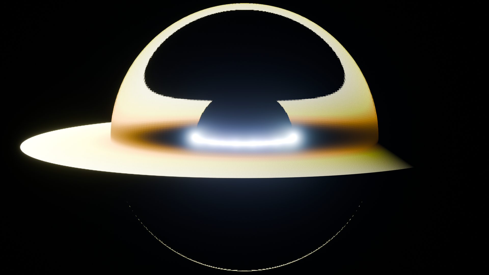

# 🕳️ 黑洞与引力透镜 — Gargantua（实时相对论渲染）

用 three.js 实时渲染的黑洞：**每个像素都在反向积分一条 Schwarzschild 弯曲时空里的类光测地线**，
不是贴图、不是 IOR 折射伪装——拖拽视角时，星场漩涡、盘绕过黑洞上下的拱、光子环全部是当场算出来的。

依据真实科学：阴影半径 b = 3√3/2 rₛ（EHT 测得 M87* 环径 42±3 μas → 6.5×10⁹ M☉）、
光子球 r = 1.5 rₛ、ISCO r = 3 rₛ（轨道速度 0.5c）、多普勒束流（M87* 南侧更亮）、
光线偏折 α = 4GM/(c²b)（1919 年爱丁顿日全食 1.75″）。

*↑ 旧版 Blender 离线渲染（艺术示意，IOR 折射伪透镜）。新版见 `index.html` / `black-hole.html`。*

## 🚀 运行

- `black-hole/index.html` — 模块化入口（开发用，配本地 http 服务）
- `black-hole/black-hole.html` — **单文件离线版**（`python3 build.py` 生成，零外链，file:// 可开）

## 🖐 交互

| 操作 | 效果 |
|---|---|
| **拖拽** | 旋转视角（透镜光实时变化） |
| **滚轮** | 推近 / 拉远 |
| **双击 / ⟲** | 回到经典机位 |
| **1–5** | 五个功能视角：全景 / 事件视界 / 引力透镜 / 吸积盘 / 多普勒 |
| **L / D** | 开关 引力透镜 / 多普勒效应（看"透镜关=土星环"对比） |
| **空格** | 暂停盘旋转 |

每个功能按钮 = **相机飞行** + 讲解面板 + 📐数据流水线（原始读数 → 应用方程 → 逐步算术 → 真实结果，
全部引用真实测量：EHT M87*、爱丁顿 1919、Shakura–Sunyaev 盘温度剖面）。

## 🔬 物理（每条都在 node / 浏览器里定量验证过）

| 物理量 | 实现 | 验证 |
|---|---|---|
| 测地线弯曲 | d²x/dλ² = −1.5·h²·x/r⁵（半隐式欧拉，自适应步长） | 临界撞击参数 2.5952 vs 解析 3√3/2 = 2.5981（0.1%） |
| 阴影尺寸 | 光子球捕获 + 视界吸收 | 渲染实测 51.5 px vs 理论 48.5 px（默认机位，6%）；127 vs 126.8 px（视界机位，0.2%） |
| 光子球/光子环 | b 略大于临界的光线绕行后逃逸 | 绕行角 1.89π @ b=2.7 |
| ISCO | 盘内缘 = 3 rₛ，v = √(M/(r−rₛ)) | 0.5c ✓ |
| 多普勒束流 | I ∝ g⁴，g = D×√(1−rₛ/r)，色温 T×g | 渲染不对称 1.47×，开关可对比 |
| 引力透镜 | 透明薄盘 + 光学薄辉光，多次穿越累积 | 开关对比：拱区亮度差 6× |
| 盘颜色 | Shakura–Sunyaev T ∝ r^(−3/4)(1−√(r_in/r))^(1/4) 黑体色 | 1919 太阳掠射 1.75″（弱场检验） |

## 📁 文件

- `index.html` + `js/glsl.js`（测地线着色器）+ `js/main.js`（轨道/功能/面板）+ `vendor/three.min.js`
- `build.py` → `black-hole.html`（单文件）
- `gargantua.blend` / `make_gargantua.py` / `gargantua.png` — 旧版 Blender 艺术渲染（保留存档）

## ⚠️ 诚实标注

- 采用**不旋转（Schwarzschild）**黑洞；电影中的 Gargantua 是近极限旋转的 Kerr 黑洞（有参考系拖曳）。
- 多普勒光变用局部静止观者分解（D×√(1−rₛ/r)），是实时渲染的标准近似。
- 盘的热轮廓/颜色按黑体计算，**非真实观测数据**；EHT 真实照片（M87*、Sgr A*）是
  光子球附近热等离子体的"甜甜圈"，本页是《星际穿越》式薄盘的合法物理解。
- 渲染分辨率自动降采样（低/中/高画质可切），暗色 skybox 星空为程序化生成。
