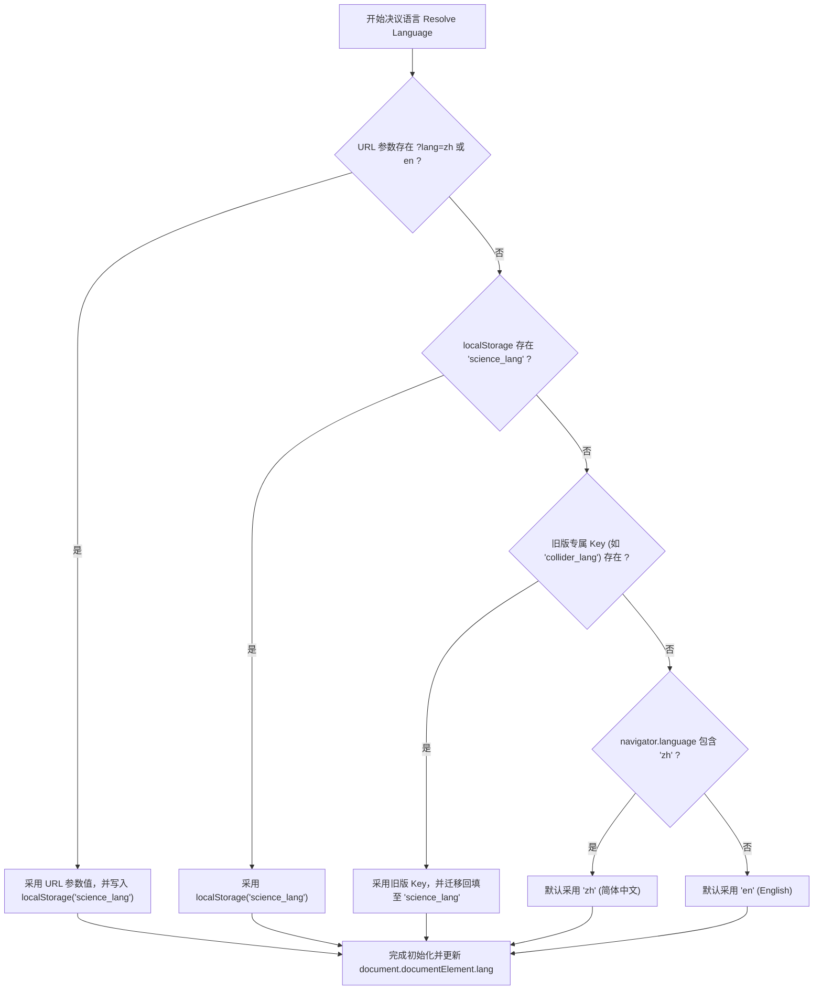
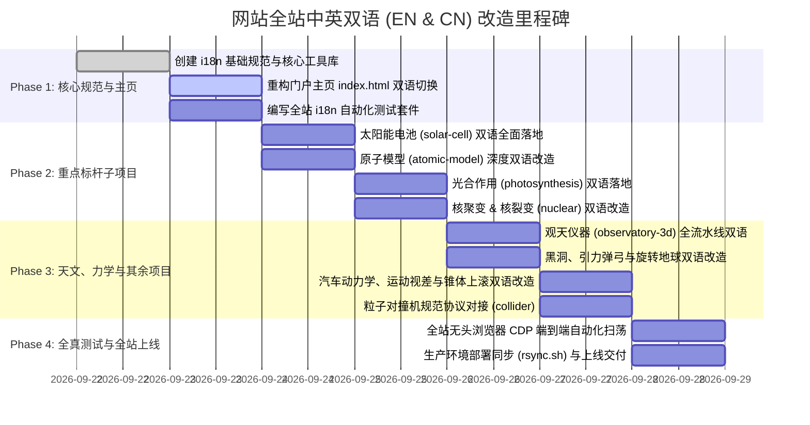

# 06 全站双语国际化 (EN & CN) 系统架构与集成规范
# (Site-wide Bilingual i18n & Localization Specification)

> **版本**：v1.0.0  
> **状态**：正式规范 (Canonical Specification)  
> **生效时间**：2026-09-22  
> **文档编号**：`docs/requirements/06-site-wide-bilingual-i18n-spec.md`  
> **适用范围**：仓库根主页 (`/index.html`) 及全部 15 个科学可视化子项目

---

## 一、 规范背景与战略愿景 (Executive Summary & Mission)

### 1.1 平台使命
“科学可视化动画库 (Science Animations)”是一个面向青少年、科学爱好者与好奇心探索者的全交互式 3D 科学与工程物理仿真平台。为了让海内外更多孩子与教育者无障碍探索：
- **核心诉求**：全站必须全面支持 **中文 (简体, zh-CN)** 与 **英文 (English, en)** 双语；
- **核心体验**：用户在根目录入口 `index.html` 切换一次语言，全站所有子项目在进入时**必须无条件遵从该语言设定**；
- **随处可变**：用户在任意子项目中也能直接切换语言，且该修改会反向持久化同步，返回主页或其他子项目时保持同步；
- **离线与单文件兼容**：严禁破坏各子项目现有的单文件离线打包能力（`build.py` 产出的单个无外链 HTML，严禁依赖外部 CDN 翻译接口）。

---

## 二、 全站现状深度分析 (Site-wide Landscape Audit)

经对仓库全站代码库进行全面深度扫描，当前由 1 个主站导航门户与 15 个独立的科学可视化仿真子项目构成：

```
Science-Animations/
├── index.html                   # 门户主页（15 个科学卡片，当前默认纯英文骨架混部分中文）
├── particle-collider/          # 粒子对撞机：★ 已具备完整双语架构（含中英文切换与 tr 字典）
├── solar-cell/                 # 太阳能电池：已实现双语元数据与双行解说（meta.title/meta.sub, showNarr(zh, en)）
├── photosynthesis/             # 光合作用：4 大章节与类囊体膜，中文为主
├── atomic-model/               # 原子模型：含双语混合标题（原子状态/Protons/State），未独立开关
├── nuclear-fusion-3d/          # 核聚变：中文主导（含 D-T / D-D / p-11B 反应选择与 10 步漫游）
├── nuclear-fission-3d/         # 核裂变：中文主导（含三幕剧、骆驼产额曲线、200 MeV 能量分配）
├── observatory-3d/             # 观天仪器：中文主导（8 大仪器全数据流水线，波段标签）
├── how-cars-work/              # 汽车动力学：中文主导（9 步点火故事、油电对比、零部件剖析）
├── gravity-slingshot/          # 引力弹弓：中文主导（旅行者号轨道、引力加速度、速度增益）
├── ion-thruster-3d/            # 离子推进器：中文主导（环形尖点磁场、双轴常平架、深空任务）
├── black-hole/                 # 相对论黑洞：中文主导（史瓦西光线追踪、引力透镜、多普勒聚束）
├── rotating-earth/             # 旋转地球：中文主导（23.44° 黄赤交角、瑞利大气散射、二十四节气）
├── solar-system/               # 太阳系探索：中文主导（8 大行星 22 卫星漫游、霍曼转移轨道）
├── motion-parallax/            # 运动视差：中文主导（驾驶座透视 vs 俯视扫角，角速度量距）
└── uphill-roller/              # 锥体上滚：中文主导（1694 年双锥体 V 轨视觉错觉几何论证）
```

### 2.1 架构分型
1. **打包离线型 (9 个子项目)**：包含 `build.py`，使用 `esbuild` 将 ES Module 依赖打成单文件离线 HTML（`atomic-model`, `black-hole`, `motion-parallax`, `observatory-3d`, `particle-collider`, `photosynthesis`, `rotating-earth`, `solar-cell`, `uphill-roller`）。
2. **直行模块型 (6 个子项目)**：直接在浏览器加载 ES Module 或标准脚本运行（`gravity-slingshot`, `how-cars-work`, `ion-thruster-3d`, `nuclear-fission-3d`, `nuclear-fusion-3d`, `solar-system`）。

### 2.2 优秀工程典范 (`particle-collider`)
`particle-collider/` 已经实现了一套极其优雅成熟的语言切换机制：
- 数据字典：`APP.lang = 'zh' | 'en'`，`APP.L = () => (APP.lang === 'zh' ? APP.DATA.zh : APP.DATA)`；
- 键值翻译：`tr(key)` 函数匹配 `'toast.lang': { en: 'Language: English', zh: '语言已切换为：中文' }`；
- 状态更新：切换时统一修改 `document.documentElement.lang`，更新按钮 `.active` 类，触发全界面刷新；
- 存储机制：`localStorage.setItem('collider_lang', lang)`。

**本规范将此优秀范式提炼升级为全站通用的标准契约。**

---

## 三、 跨项目全局国际化契约 (The Global i18n Protocol)

### 3.1 统一存储与多级决议仲裁 (Resolution Ladder)
所有项目必须严格按照如下优先级阶梯，在页面加载的第一微秒内决议出当前生效语言：



### 3.2 权威键名与合法枚举 (SSOT Contract)
- **标准主存储键**：`'science_lang'`；
- **旧版兼容读取键**：`'collider_lang'`（向后兼容）；
- **合法取值集合**：严格限定为 `'zh'` 与 `'en'` 两类；任何其他输入一律回退为 `'zh'`；
- **HTML 根语言标签同步**：
  - 当为 `'zh'` 时：`document.documentElement.lang = 'zh-CN'`；
  - 当为 `'en'` 时：`document.documentElement.lang = 'en'`。

### 3.3 链接传播与防沙箱穿透机制 (Cross-Directory Link Sync)
由于部分用户可能会通过本地文件系统双击 `file://` 打开不同文件夹，不同浏览器的 `file://` 沙箱可能导致 `localStorage` 隔离。为保证 100% 鲁棒：
1. **主页传出链接**：`index.html` 在渲染或切换语言时，自动将所有 15 个卡片的 `href` 尾部附加或更新 `?lang=zh` 或 `?lang=en`（如 `solar-cell/?lang=en`）；
2. **子项目返回链接**：各子项目中的 `#homeBtn` 返回首页链接，统一附加 `../index.html?lang=${currentLang}`；
3. **子项目读取**：子项目在启动初始化时，优先解析 `window.location.search` 中的 `lang` 参数。

---

## 四、 根目录门户 (`index.html`) 双语改造规范

### 4.1 顶部浮动语言切换器 (Header Switcher UI)
在主页顶部导航栏右上方（或主标题右上方）部署轻量科技质感切换药丸（Pill Switcher）：

```html
<div class="lang-switch" role="group" aria-label="Language Switcher">
  <button id="btnLangZh" class="lang-btn active" data-lang="zh">🇨🇳 中文</button>
  <button id="btnLangEn" class="lang-btn" data-lang="en">🇬🇧 EN</button>
</div>
```

### 4.2 视觉与交互规范
- **默认样式**：采用玻璃拟态暗黑背景 `rgba(13,18,33,0.85)`，边框 `rgba(255,255,255,0.12)`；
- **高亮态**：激活项带有科技金光芒或琥珀色微光（`#fbbf24` 或 `#d8b25c`），底色 `rgba(251,191,36,0.15)`；
- **即时响应**：点击后全页面无白屏闪烁，所有 DOM 节点文案在当前帧立即蜕变，并在毫秒级完成 `localStorage` 写入与所有子链接 query string 更新。

### 4.3 15 个卡片的双语对照字典 (Root Portal Localization Matrix)

| 项目 Key | 中文标题 (zh) | 英文标题 (en) | 中文描述 (zh) | 英文描述 (en) |
| :--- | :--- | :--- | :--- | :--- |
| **portal** | 科学可视化动画库 | Science Animations | 生动逼真的 3D 物理与工程交互仿真 — 为好奇心与探索而建 | Interactive simulations that bring physics and engineering to life — built for curious minds. |
| **slingshot** | 引力弹弓航行模拟 | Gravity Slingshot | 漫游太阳系：看航天器如何利用行星引力实现无动力加速突破深空 | Fly through the solar system and see how spacecraft use planetary gravity to accelerate — no fuel needed. |
| **car** | 汽车是怎么跑起来的？ | How Cars Work | 3D 动力传动全景机械透视：发动机四冲程、变速箱离合器、差速器与油电对比 | A full 3D powertrain simulation — watch the engine, transmission, and wheels work together. |
| **ion3d** | 离子推进器 3D | Ion Thruster 3D | NASA 栅格离子推进器仿真：探索环形磁阱、微观离子光学透镜与深空常平架推力矢量 | NASA NSTAR / NEXT gridded ion engine: explore ring cusp magnetics, ion optics, and 2-axis gimbal TVC. |
| **atom** | 原子模型与能级跃迁 | Atomic Model | 3D 探索原子结构：看电子轨道跃迁、光子吸收与发射，分清激发与电离 | Explore atoms in 3D: watch electron transitions, photon absorption/emission, and ionization. |
| **fusion** | 核聚变 3D 交互动画 | Nuclear Fusion | 看氘氚离子克服库仑斥力相撞聚变成氦，释放恒星能量 $E=mc^2$ | Watch deuterium and tritium heat into plasma, collide against repulsion, fuse into helium, and release energy via E=mc². |
| **solar** | 太阳能电池：光子到电流 | Solar Cell | 5章微观探索：晶格、掺杂、PN结滑梯、光子一生与 27.81% 效率天平与叠层未来 | A 5-chapter interactive journey: crystal lattice, doping, PN junction slide, photon life, and the 27.81% efficiency budget. |
| **fission** | 核裂变 3D 交互动画 | Nuclear Fission | 轰击铀-235 原子核：三幕看懂不对称分裂、链式反应、慢化剂与 200 MeV 能量分配 | Fire a neutron at U-235 and watch asymmetric split, chain reactions, moderation, and 200 MeV energy partition. |
| **blackhole**| 相对论黑洞与引力透镜 | Black Hole Gargantua | 实时相对论测地线光线追踪：视界阴影、光子球层、弯曲吸积盘与多普勒聚束 | Real-time geodesic ray tracer: event horizon shadow, photon ring, lensed accretion disk, and Doppler beaming. |
| **earth** | 旋转地球与实时昼夜 | Rotating Earth | 太空视角 3D 地球自转：23.44° 黄赤交角、瑞利大气辉光、城市夜光与二十四节气 | 3D Earth rotation from space featuring 23.44° axial tilt, Rayleigh atmospheric glow, and city lights. |
| **collider** | 粒子对撞机探秘 | Particle Collider | 探索微观神机：逐层拆解 37,000 个探测器部件、逆向双束对撞与合成物理反应 | Explore an LHC & ATLAS-inspired detector: disassemble 37,000 parts, watch counter-rotating beams, and trigger collision events. |
| **solarsystem**| 太阳系探索者 | Solar System Explorer | 太阳与 8 大行星 22 颗卫星全景三维轨道漫游，支持霍曼转移轨道规划 | Interactive 3D solar system with Sun, 8 planets, 22 moons, and Hohmann transfer orbit flight planner. |
| **observatory**| 观天仪器：如何观测宇宙 | Observatory 3D | 8 大现代天文观测仪器全景：光学折反射、光谱仪、多普勒红移、干涉仪与引力波 | How we observe the universe: 8 interactive 3D instruments showing raw readings to published science results. |
| **parallax** | 运动视差几何全解 | Motion Parallax | 为什么近快远慢？驾驶位透视 $\omega \approx v/d$、俯视扫角与同一几何测定恒星距离 | Why near objects move faster than far ones: perspective view, angular sweep geometry, and stellar parallax distance ladder. |
| **uphill** | 锥体上滚视觉错觉 | Uphill Roller | 双锥体沿 V 轨神奇向上爬坡 —— 几何解析重心真实下降，验证经典错觉力学条件 | Double cone rolling uphill on V-tracks illusion: geometric proof that center of mass actually descends. |
| **photo** | 光合作用：叶片能量工厂 | Photosynthesis | 叶片宏观到微观类囊体膜：光子驱动电子 Z 链传递、Kok循环析氧、ATP合成酶与暗反应拼糖 | From leaf to thylakoid membrane: watch Z-scheme electron flow, Kok oxygen cycle, ATP synthase rotor, and Calvin cycle. |

---

## 五、 全局公共工具库规范 (`common/js/i18n.js`)

为避免 15 个子项目重复造轮子，我们在根目录提供通用的轻量化微内核 `common/js/i18n.js`（纯 JS，压缩后 < 1.5 KB，零任何第三方依赖），同时向各项目单文件打包器友好开放。

### 5.1 API 契约定义

```javascript
/**
 * science-i18n.js — Unified internationalization micro-library
 */
export class ScienceI18n {
  constructor(options = {}) {
    this.storageKey = 'science_lang';
    this.legacyKey = options.legacyKey || null;
    this.dict = options.dict || {};
    this.onLangChange = options.onLangChange || null;
    this.lang = this.resolveInitialLang();
  }

  resolveInitialLang() {
    // 1. URL search param
    try {
      const urlParam = new URLSearchParams(window.location.search).get('lang');
      if (urlParam === 'zh' || urlParam === 'en') {
        this.persist(urlParam);
        return urlParam;
      }
    } catch (e) {}

    // 2. localStorage science_lang
    try {
      const saved = localStorage.getItem(this.storageKey);
      if (saved === 'zh' || saved === 'en') return saved;
    } catch (e) {}

    // 3. Legacy project-specific key
    if (this.legacyKey) {
      try {
        const leg = localStorage.getItem(this.legacyKey);
        if (leg === 'zh' || leg === 'en') {
          this.persist(leg);
          return leg;
        }
      } catch (e) {}
    }

    // 4. Browser language fallback
    const nav = (navigator.language || navigator.userLanguage || '').toLowerCase();
    return nav.startsWith('zh') ? 'zh' : 'en';
  }

  setLang(lang) {
    if (lang !== 'zh' && lang !== 'en') return;
    if (this.lang === lang) return;
    this.lang = lang;
    this.persist(lang);
    this.applyToDOM();
    if (typeof this.onLangChange === 'function') {
      this.onLangChange(lang);
    }
  }

  persist(lang) {
    try {
      localStorage.setItem(this.storageKey, lang);
      if (this.legacyKey) localStorage.setItem(this.legacyKey, lang);
    } catch (e) {}
  }

  applyToDOM() {
    document.documentElement.lang = (this.lang === 'zh') ? 'zh-CN' : 'en';
    // Update active state of switch buttons
    document.querySelectorAll('[data-lang-btn]').forEach(el => {
      el.classList.toggle('active', el.dataset.langBtn === this.lang);
    });
  }

  t(key, fallback = '') {
    const entry = this.dict[key];
    if (!entry) return fallback || key;
    return entry[this.lang] || entry.zh || fallback || key;
  }
}
```

---

## 六、 15 个子项目双语改造实施细则

每个子项目均需满足如下三层双语重构：

### 6.1 顶栏统一控制按钮规范 (Top Navigation Anchor)
在各子项目的全局返回按钮 `<a id="homeBtn" href="../index.html">🏠 首页</a>` 旁边，统一紧邻挂载双语药丸切换按钮：
```html
<a id="homeBtn" href="../index.html" title="返回首页 / Home">🏠 首页</a>
<div id="langToggle" class="subapp-lang-toggle">
  <button class="lang-btn" data-lang-btn="zh">中</button>
  <button class="lang-btn" data-lang-btn="en">EN</button>
</div>
```
- 点击切换后，无需整页刷新，动态触发该子项目核心 UI 重绘；
- 存储自动同步至 `localStorage.getItem('science_lang')`；
- 用户下一次点击 `#homeBtn` 返回主页时，主页自动以所选语言呈现！

---

### 6.2 重点子项目改造档案 (Per-Project Implementation Plan)

#### 1. 太阳能电池 (`solar-cell/`)
- **已有优势**：解说框已原生支持 `showNarr(zhHtml, enSub)` 双语调用；`ch1~ch5` 元数据已定义 `meta.title` 与 `meta.sub`；
- **重构点**：
  - 章节导航器 (`#chapters`)：中文（“第1章 从原子到晶体”）/ 英文（“Ch 1 Atoms to Crystal”）；
  - 电路仪表盘 (`#infoPanel`)：`电压 / Voltage` 与 `电流 / Current`；
  - 底部操作栏 (`#actionBtns`)：全部按钮支持中英文标签；
  - 3D 空间标签 (`makeTextSprite`)：根据语言动态切换，如金字塔绒面（Pyramid Texture）、减反射膜（SiNx ARC）、n+发射极（n+ Emitter）、p型硅基底（p-Si Bulk）、背面电极（Back Mirror）；
  - 单结与叠层天平（100 块阳光分解）：亚带隙穿透（Sub-bandgap pass）、高能热化（Thermalization）、辐射复合（SQ Limit）、俄歇复合（Auger Limit）、HIBC纪录（Record 27.81%）、钙钛矿/硅叠层（Perovskite/Si Tandem 35.5%）。

#### 2. 光合作用 (`photosynthesis/`)
- **重构点**：
  - 4 大视点（叶片宏观 / 叶绿体 / 类囊体膜光反应 / 卡尔文循环暗反应）；
  - 类囊体膜核心蛋白复合体标定（PSII 光系统II, 细胞色素 b6f, PSI 光系统I, ATP 合成酶, 铁氧还蛋白 FNR）；
  - 电子传递 Z-scheme 能量爬坡动效文字；
  - Kok 循环水氧化钟 ($S_0 \to S_1 \to S_2 \to S_3 \to S_4 \to \text{O}_2$)；
  - 卡尔文暗反应拼糖三阶段（碳固定 Carbon Fixation、碳还原 Reduction、RuBP再生 Regeneration）。

#### 3. 原子模型 (`atomic-model/`)
- **重构点**：
  - 原子状态面板：质子（Protons）、中子（Neutrons）、电子（Electrons）、净电荷（Net Charge）、能级状态（Ground / Excited / Ionized）；
  - 光子信息指示卡：入射/释放光子能量（Photon Energy $h\nu$）、跃迁波长（Wavelength $\lambda$）、能级落差（Transition $n_1 \to n_2$）；
  - 能级阶梯图（Bohr 能级图与赖曼/巴耳末线系谱线）。

#### 4. 核聚变 (`nuclear-fusion-3d/`) 与 核裂变 (`nuclear-fission-3d/`)
- **核聚变**：
  - 3 大反应类型选择：D-T (氘-氚)、D-D (氘-氘)、p-¹¹B (质子-硼11洁净聚变)；
  - 10 步互动导览故事（从宏观托卡马克线圈到微观克服库仑排斥隧穿聚变）；
  - 能量比重显示：中子动能 14.1 MeV 与 α 粒子动能 3.5 MeV。
- **核裂变**：
  - 三幕剧分幕叙事（中子俘获液滴震颤、非对称两体分裂、慢化剂与链式反应）；
  - 骆驼双峰产额曲线图文字（轻峰 A≈95、重峰 A≈139、对称分裂谷 <0.01%）；
  - 200 MeV 能量分配饼图与条形图。

#### 5. 观天仪器 (`observatory-3d/`)
- **重构点**：
  - 8 大仪器选择卡：折反射望远镜、光栅光谱仪、多普勒红移测速、迈克尔逊干涉仪、自适应光学(AO)、高灵敏CCD/CMOS探测器、非电磁波引力波LIGO探测器、多信使天文学；
  - 数据流水线 3 阶段（原始观测 Raw Reading $\to$ 物理校准 Calibration $\to$ 顶刊发表数据 Published Result）；
  - 电磁波谱段过滤条（射电 Radio, 红外 IR, 可见光 Visible, 紫外 UV, X射线, 伽马射线）。

#### 6. 汽车是怎么跑起来的 (`how-cars-work/`)
- **重构点**：
  - 燃油车 vs 纯电动车模式切换；
  - 9 步点火启动故事剧情字幕；
  - 零部件剖析（曲轴 Crankshaft, 活塞 Piston, 火花塞 Spark Plug, 进排气门 Valves, 飞轮 Flywheel, 离合器 Clutch, 手动/自动变速箱 Gearbox, 传动轴 Driveshaft, 差速器 Differential, 盘式制动器 Brakes, 交流永磁同步电机 EV Traction Motor）；
  - 仪表盘数据（转速 RPM, 扭矩 Torque, 实时挡位 Gear）。

#### 7. 相对论黑洞 (`black-hole/`)
- **重构点**：
  - 物理控件 HUD：引力透镜开关（Gravitational Lensing）、相对论多普勒聚束（Relativistic Doppler Beaming）、广义相对论测地线积分器参数；
  - 核心物理层注记：事件视界（Event Horizon, $r=2M$）、光子球层（Photon Sphere, $r=3M$）、最内稳定圆轨道（ISCO, $r=6M$）。

#### 8. 引力弹弓 (`gravity-slingshot/`)
- **重构点**：
  - 飞行遥测状态栏：当前航速（Speed）、引力弹弓增益（Gravity Assist Boost）、引力加速度（Acceleration）；
  - 任务阶段提示卡：地球起飞 $\to$ 木星飞掠 $\to$ 土星弹弓 $\to$ 冲出太阳系；
  - 真实物理图例：实际双曲轨道 vs 惯性直线轨道 vs 引力矢量线。

#### 9. 离子推进器 (`ion-thruster-3d/`)
- **重构点**：
  - 4 大视角切换：推进器全貌（Overall View）、环形尖点磁阱（Ring Cusp Magnetic Trap）、单微孔双栅极静电透镜（Ion Optics）、双轴万向常平架（2-Axis Gimbal）；
  - 深空任务预设：深空1号 (Deep Space 1)、黎明号谷神星探索 (Dawn)。

#### 10. 旋转地球 (`rotating-earth/`)
- **重构点**：
  - 季节与节气选择（春分/秋分 Equinox、夏至 Summer Solstice、冬至 Winter Solstice）；
  - 昼夜分界线（Terminator）与地球自转轴倾角（23.44° Axial Tilt）图解；
  - 城市注记（北京、伦敦、纽约、东京等）。

#### 11. 太阳系探索者 (`solar-system/`)
- **重构点**：
  - 天体信息面板（太阳、水星、金星、地球、火星、木星、土星、天王星、海王星，各卫星半径、轨道半长轴、周期）；
  - 航天轨道规划器（霍曼转移轨道、入轨速度、发射窗口期计算）。

#### 12. 运动视差 (`motion-parallax/`)
- **重构点**：
  - 双视点切换：驾驶员座舱透视视角 vs 天顶俯视扫角透视；
  - 物理感知公式标定：角速度 $\omega \approx v/d$；
  - 恒星周年视差测距滑块（从公里到秒差距 parsec）。

#### 13. 锥体上滚 (`uphill-roller/`)
- **重构点**：
  - 三大几何参数滑块：导轨坡度角 $\alpha$、导轨开角 $\beta$、圆锥顶半角 $\gamma$；
  - 力学重心判据：重心高度变化曲线 $\Delta h(x)$ 与滚动驱动力分析。

---

## 七、 自动化事实测试与构建部署准则 (Testing & Deployment)

### 7.1 单元测试断言覆盖 (`tests/i18n.test.mjs`)
在根目录建立全局国际化自动化测试套件，执行 `node --test tests/i18n.test.mjs`，必须强制覆盖如下测试断言：
1. **默认语言决议断言**：当无任何参数和缓存时，中文环境返回 `'zh'`，非中文返回 `'en'`；
2. **URL 参数最高优先权断言**：当 `?lang=en` 传入时，即便 `localStorage` 为 `'zh'`，也必须强制以 `'en'` 生效并更新存储；
3. **双向持久化自洽断言**：主页设置 `'en'` 后，模拟子项目读取必须获得 `'en'`；子项目设置 `'zh'` 后，模拟主页读取必须获得 `'zh'`；
4. **15 卡片字典完备度断言**：验证 `index.html` 所注册的 15 个子项目全部具备非空的 `zh` 与 `en` 标题与描述；
5. **DOM 属性同步断言**：切换至 `'zh'` 时 `document.documentElement.lang` 为 `'zh-CN'`，切换至 `'en'` 时为 `'en'`；
6. **零 CDN 外部引用断言**：各子项目打出的单文件（如 `solar-cell.html`, `atomic-model.html` 等）严禁引入任何未打包的外部翻译脚本，字典必须内联。

### 7.2 离线单文件构建一致性 (`build.py`)
凡包含 `build.py` 的子项目，在执行打包命令后：
- 单文件 HTML 必须内置双语字典和切换逻辑；
- 打包产物体积增幅不得超过 5%，离线本地双击即可任意切换中英文。

### 7.3 服务器部署验证
运行 `./rsync.sh` 同步至生产环境（`vps4` 与 `vps5`）后：
- 浏览器打开生产根域名，测试语言切换；
- 依次点击卡片跳转到子项目，验证子项目完全遵从主页选择的语言；
- 在子项目中将语言翻转，点击返回首页，验证首页语言同步变更。

---

## 八、 实施里程碑计划 (Implementation Roadmap)



---
*本规范为全站双语国际化改造的唯一法定技术蓝图与实施基准。*
