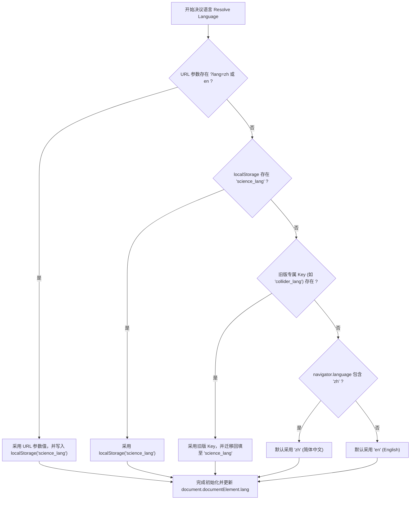
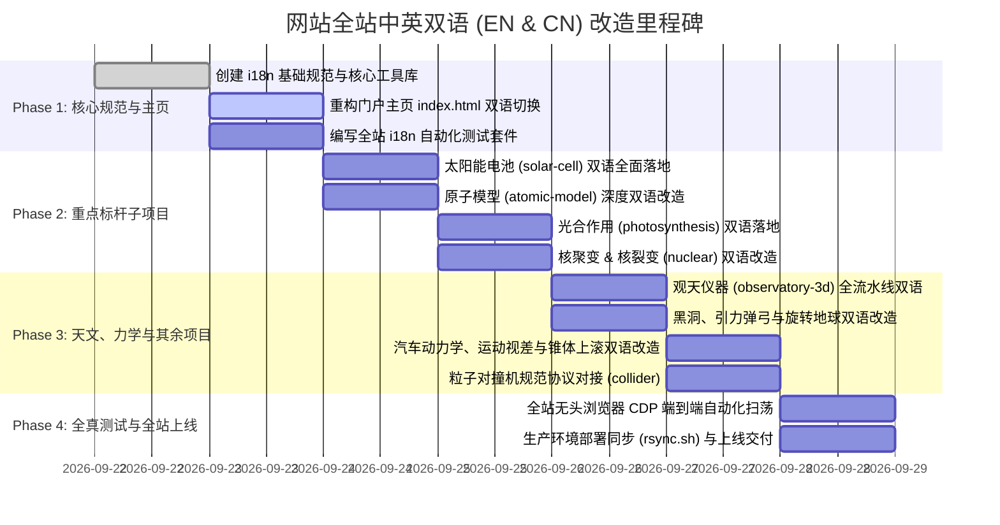

# 08 全站双语国际化 (EN & CN) 系统架构与集成规范
# (Site-wide Bilingual i18n & Localization Specification)

> **版本**：v2.0.0 (深度质询与终审裁决版)  
> **状态**：正式规范 (Canonical Specification)  
> **生效时间**：2026-09-22  
> **文档编号**：`docs/requirements/08-site-wide-bilingual-i18n-spec.md`  
> **适用范围**：仓库根主页 (`/index.html`) 及全部 15 个科学可视化子项目

---

## 一、 规范背景与战略愿景 (Executive Summary & Mission)

### 1.1 平台使命
“科学可视化动画库 (Science Animations)”是一个面向青少年、科学爱好者与好奇心探索者的全交互式 3D 科学与工程物理仿真平台。为了让海内外更多孩子与教育者无障碍探索：
- **核心诉求**：全站必须全面支持 **中文 (简体, zh-CN)** 与 **英文 (English, en)** 双语；
- **核心体验**：用户在根目录入口 `index.html` 切换一次语言，全站所有子项目在进入时**必须无条件遵从该语言设定**；
- **随处可变**：用户在任意子项目中也能直接切换语言，且该修改会反向持久化同步，返回主页或其他子项目时保持同步；
- **离线与单文件兼容**：严禁破坏各子项目现有的单文件离线打包能力（`build.py` 产出的单个无外链 HTML，严禁依赖外部 CDN 翻译接口）。

---

## 二、 全站现状深度分析 (Site-wide Landscape Audit)

经对仓库全站代码库进行全面深度扫描，当前由 1 个主站导航门户与 15 个独立的科学可视化仿真子项目构成：

```
Science-Animations/
├── index.html                   # 门户主页（15 个科学卡片，当前默认纯英文骨架混部分中文）
├── particle-collider/          # 粒子对撞机：★ 已具备完整双语架构（含中英文切换与 tr 字典）
├── solar-cell/                 # 太阳能电池：已实现双语元数据与双行解说（meta.title/meta.sub, showNarr(zh, en)）
├── photosynthesis/             # 光合作用：4 大章节与类囊体膜，中文为主
├── atomic-model/               # 原子模型：含双语混合标题（原子状态/Protons/State），未独立开关
├── nuclear-fusion-3d/          # 核聚变：中文主导（含 D-T / D-D / p-11B 反应选择与 10 步漫游）
├── nuclear-fission-3d/         # 核裂变：中文主导（含三幕剧、骆驼产额曲线、200 MeV 能量分配）
├── observatory-3d/             # 观天仪器：中文主导（8 大仪器全数据流水线，波段标签）
├── how-cars-work/              # 汽车动力学：中文主导（9 步点火故事、油电对比、零部件剖析）
├── gravity-slingshot/          # 引力弹弓：中文主导（旅行者号轨道、引力加速度、速度增益）
├── ion-thruster-3d/            # 离子推进器：中文主导（环形尖点磁场、双轴常平架、深空任务）
├── black-hole/                 # 相对论黑洞：中文主导（史瓦西光线追踪、引力透镜、多普勒聚束）
├── rotating-earth/             # 旋转地球：中文主导（23.44° 黄赤交角、瑞利大气散射、二十四节气）
├── solar-system/               # 太阳系探索：中文主导（8 大行星 22 卫星漫游、霍曼转移轨道）
├── motion-parallax/            # 运动视差：中文主导（驾驶座透视 vs 俯视扫角，角速度量距）
└── uphill-roller/              # 锥体上滚：中文主导（1694 年双锥体 V 轨视觉错觉几何论证）
```

### 2.1 架构分型
1. **打包离线型 (9 个子项目)**：包含 `build.py`，使用 `esbuild` 将 ES Module 依赖打成单文件离线 HTML（`atomic-model`, `black-hole`, `motion-parallax`, `observatory-3d`, `particle-collider`, `photosynthesis`, `rotating-earth`, `solar-cell`, `uphill-roller`）。
2. **直行模块型 (6 个子项目)**：直接在浏览器加载 ES Module 或标准脚本运行（`gravity-slingshot`, `how-cars-work`, `ion-thruster-3d`, `nuclear-fission-3d`, `nuclear-fusion-3d`, `solar-system`）。

### 2.2 优秀工程典范 (`particle-collider`)
`particle-collider/` 已经实现了一套极其优雅成熟的语言切换机制：
- 数据字典：`APP.lang = 'zh' | 'en'`，`APP.L = () => (APP.lang === 'zh' ? APP.DATA.zh : APP.DATA)`；
- 键值翻译：`tr(key)` 函数匹配 `'toast.lang': { en: 'Language: English', zh: '语言已切换为：中文' }`；
- 状态更新：切换时统一修改 `document.documentElement.lang`，更新按钮 `.active` 类，触发全界面刷新；
- 存储机制：`localStorage.setItem('collider_lang', lang)`。

**本规范将此优秀范式提炼升级为全站通用的标准契约。**

---

## 三、 跨项目全局国际化契约 (The Global i18n Protocol)

### 3.1 统一存储与多级决议仲裁 (Resolution Ladder)
所有项目必须严格按照如下优先级阶梯，在页面加载的第一微秒内决议出当前生效语言：



### 3.2 权威键名与合法枚举 (SSOT Contract)
- **标准主存储键**：`'science_lang'`；
- **旧版兼容读取键**：`'collider_lang'`（向后兼容）；
- **合法取值集合**：严格限定为 `'zh'` 与 `'en'` 两类；任何其他输入一律回退为 `'zh'`；
- **HTML 根语言标签同步**：
  - 当为 `'zh'` 时：`document.documentElement.lang = 'zh-CN'`；
  - 当为 `'en'` 时：`document.documentElement.lang = 'en'`。

### 3.3 链接传播与防沙箱穿透机制 (Cross-Directory Link Sync)
由于部分用户可能会通过本地文件系统双击 `file://` 打开不同文件夹，不同浏览器的 `file://` 沙箱可能导致 `localStorage` 隔离。为保证 100% 鲁棒：
1. **主页传出链接**：`index.html` 在渲染或切换语言时，自动将所有 15 个卡片的 `href` 尾部附加或更新 `?lang=zh` 或 `?lang=en`（如 `solar-cell/?lang=en`）；
2. **子项目返回链接**：各子项目中的 `#homeBtn` 返回首页链接，统一附加 `../index.html?lang=${currentLang}`；
3. **子项目读取**：子项目在启动初始化时，优先解析 `window.location.search` 中的 `lang` 参数。

---

## 四、 根目录门户 (`index.html`) 双语改造规范

### 4.1 顶部浮动语言切换器 (Header Switcher UI)
在主页顶部导航栏右上方（或主标题右上方）部署轻量科技质感切换药丸（Pill Switcher）：

```html
<div class="lang-switch" role="group" aria-label="Language Switcher">
  <button id="btnLangZh" class="lang-btn active" data-lang="zh">🇨🇳 中文</button>
  <button id="btnLangEn" class="lang-btn" data-lang="en">🇬🇧 EN</button>
</div>
```

### 4.2 视觉与交互规范
- **默认样式**：采用玻璃拟态暗黑背景 `rgba(13,18,33,0.85)`，边框 `rgba(255,255,255,0.12)`；
- **高亮态**：激活项带有科技金光芒或琥珀色微光（`#fbbf24` 或 `#d8b25c`），底色 `rgba(251,191,36,0.15)`；
- **即时响应**：点击后全页面无白屏闪烁，所有 DOM 节点文案在当前帧立即蜕变，并在毫秒级完成 `localStorage` 写入与所有子链接 query string 更新。

### 4.3 15 个卡片的双语对照字典 (Root Portal Localization Matrix)

| 项目 Key | 中文标题 (zh) | 英文标题 (en) | 中文描述 (zh) | 英文描述 (en) |
| :--- | :--- | :--- | :--- | :--- |
| **portal** | 科学可视化动画库 | Science Animations | 生动逼真的 3D 物理与工程交互仿真 — 为好奇心与探索而建 | Interactive simulations that bring physics and engineering to life — built for curious minds. |
| **slingshot** | 引力弹弓航行模拟 | Gravity Slingshot | 漫游太阳系：看航天器如何利用行星引力实现无动力加速突破深空 | Fly through the solar system and see how spacecraft use planetary gravity to accelerate — no fuel needed. |
| **car** | 汽车是怎么跑起来的？ | How Cars Work | 3D 动力传动全景机械透视：发动机四冲程、变速箱离合器、差速器与油电对比 | A full 3D powertrain simulation — watch the engine, transmission, and wheels work together. |
| **ion3d** | 离子推进器 3D | Ion Thruster 3D | NASA 栅格离子推进器仿真：探索环形磁阱、微观离子光学透镜与深空常平架推力矢量 | NASA NSTAR / NEXT gridded ion engine: explore ring cusp magnetics, ion optics, and 2-axis gimbal TVC. |
| **atom** | 原子模型与能级跃迁 | Atomic Model | 3D 探索原子结构：看电子轨道跃迁、光子吸收与发射，分清激发与电离 | Explore atoms in 3D: watch electron transitions, photon absorption/emission, and ionization. |
| **fusion** | 核聚变 3D 交互动画 | Nuclear Fusion | 看氘氚离子克服库仑斥力相撞聚变成氦，释放恒星能量 $E=mc^2$ | Watch deuterium and tritium heat into plasma, collide against repulsion, fuse into helium, and release energy via E=mc². |
| **solar** | 太阳能电池：光子到电流 | Solar Cell | 5章微观探索：晶格、掺杂、PN结滑梯、光子一生与 27.81% 效率天平与叠层未来 | A 5-chapter interactive journey: crystal lattice, doping, PN junction slide, photon life, and the 27.81% efficiency budget. |
| **fission** | 核裂变 3D 交互动画 | Nuclear Fission | 轰击铀-235 原子核：三幕看懂不对称分裂、链式反应、慢化剂与 200 MeV 能量分配 | Fire a neutron at U-235 and watch asymmetric split, chain reactions, moderation, and 200 MeV energy partition. |
| **blackhole**| 相对论黑洞与引力透镜 | Black Hole Gargantua | 实时相对论测地线光线追踪：视界阴影、光子球层、弯曲吸积盘与多普勒聚束 | Real-time geodesic ray tracer: event horizon shadow, photon ring, lensed accretion disk, and Doppler beaming. |
| **earth** | 旋转地球与实时昼夜 | Rotating Earth | 太空视角 3D 地球自转：23.44° 黄赤交角、瑞利大气辉光、城市夜光与二十四节气 | 3D Earth rotation from space featuring 23.44° axial tilt, Rayleigh atmospheric glow, and city lights. |
| **collider** | 粒子对撞机探秘 | Particle Collider | 探索微观神机：逐层拆解 37,000 个探测器部件、逆向双束对撞与合成物理反应 | Explore an LHC & ATLAS-inspired detector: disassemble 37,000 parts, watch counter-rotating beams, and trigger collision events. |
| **solarsystem**| 太阳系探索者 | Solar System Explorer | 太阳与 8 大行星 22 颗卫星全景三维轨道漫游，支持霍曼转移轨道规划 | Interactive 3D solar system with Sun, 8 planets, 22 moons, and Hohmann transfer orbit flight planner. |
| **observatory**| 观天仪器：如何观测宇宙 | Observatory 3D | 8 大现代天文观测仪器全景：光学折反射、光谱仪、多普勒红移、干涉仪与引力波 | How we observe the universe: 8 interactive 3D instruments showing raw readings to published science results. |
| **parallax** | 运动视差几何全解 | Motion Parallax | 为什么近快远慢？驾驶位透视 $\omega \approx v/d$、俯视扫角与同一几何测定恒星距离 | Why near objects move faster than far ones: perspective view, angular sweep geometry, and stellar parallax distance ladder. |
| **uphill** | 锥体上滚视觉错觉 | Uphill Roller | 双锥体沿 V 轨神奇向上爬坡 —— 几何解析重心真实下降，验证经典错觉力学条件 | Double cone rolling uphill on V-tracks illusion: geometric proof that center of mass actually descends. |
| **photo** | 光合作用：叶片能量工厂 | Photosynthesis | 叶片宏观到微观类囊体膜：光子驱动电子 Z 链传递、Kok循环析氧、ATP合成酶与暗反应拼糖 | From leaf to thylakoid membrane: watch Z-scheme electron flow, Kok oxygen cycle, ATP synthase rotor, and Calvin cycle. |

---

## 五、 全局公共工具库规范 (`common/js/i18n.js`)

为避免 15 个子项目重复造轮子，我们在根目录提供通用的轻量化微内核 `common/js/i18n.js`（纯 JS，压缩后 < 1.5 KB，零任何第三方依赖），同时向各项目单文件打包器友好开放。

### 5.1 API 契约定义

```javascript
/**
 * science-i18n.js — Unified internationalization micro-library
 */
export class ScienceI18n {
  constructor(options = {}) {
    this.storageKey = 'science_lang';
    this.legacyKey = options.legacyKey || null;
    this.dict = options.dict || {};
    this.onLangChange = options.onLangChange || null;
    this.lang = this.resolveInitialLang();
  }

  resolveInitialLang() {
    // 1. URL search param
    try {
      const urlParam = new URLSearchParams(window.location.search).get('lang');
      if (urlParam === 'zh' || urlParam === 'en') {
        this.persist(urlParam);
        return urlParam;
      }
    } catch (e) {}

    // 2. localStorage science_lang
    try {
      const saved = localStorage.getItem(this.storageKey);
      if (saved === 'zh' || saved === 'en') return saved;
    } catch (e) {}

    // 3. Legacy project-specific key
    if (this.legacyKey) {
      try {
        const leg = localStorage.getItem(this.legacyKey);
        if (leg === 'zh' || leg === 'en') {
          this.persist(leg);
          return leg;
        }
      } catch (e) {}
    }

    // 4. Browser language fallback
    const nav = (navigator.language || navigator.userLanguage || '').toLowerCase();
    return nav.startsWith('zh') ? 'zh' : 'en';
  }

  setLang(lang) {
    if (lang !== 'zh' && lang !== 'en') return;
    if (this.lang === lang) return;
    this.lang = lang;
    this.persist(lang);
    this.applyToDOM();
    if (typeof this.onLangChange === 'function') {
      this.onLangChange(lang);
    }
  }

  persist(lang) {
    try {
      localStorage.setItem(this.storageKey, lang);
      if (this.legacyKey) localStorage.setItem(this.legacyKey, lang);
    } catch (e) {}
  }

  applyToDOM() {
    document.documentElement.lang = (this.lang === 'zh') ? 'zh-CN' : 'en';
    // Update active state of switch buttons
    document.querySelectorAll('[data-lang-btn]').forEach(el => {
      el.classList.toggle('active', el.dataset.langBtn === this.lang);
    });
  }

  t(key, fallback = '') {
    const entry = this.dict[key];
    if (!entry) return fallback || key;
    return entry[this.lang] || entry.zh || fallback || key;
  }
}
```

---

## 六、 15 个子项目双语改造实施细则

每个子项目均需满足如下三层双语重构：

### 6.1 顶栏统一控制按钮规范 (Top Navigation Anchor)
在各子项目的全局返回按钮 `<a id="homeBtn" href="../index.html">🏠 首页</a>` 旁边，统一紧邻挂载双语药丸切换按钮：
```html
<a id="homeBtn" href="../index.html" title="返回首页 / Home">🏠 首页</a>
<div id="langToggle" class="subapp-lang-toggle">
  <button class="lang-btn" data-lang-btn="zh">中</button>
  <button class="lang-btn" data-lang-btn="en">EN</button>
</div>
```
- 点击切换后，无需整页刷新，动态触发该子项目核心 UI 重绘；
- 存储自动同步至 `localStorage.getItem('science_lang')`；
- 用户下一次点击 `#homeBtn` 返回主页时，主页自动以所选语言呈现！

---

## 七、 自动化事实测试与构建部署准则 (Testing & Deployment)

### 7.1 单元测试断言覆盖 (`tests/i18n.test.mjs`)
在根目录建立全局国际化自动化测试套件，执行 `node --test tests/i18n.test.mjs`，必须强制覆盖如下测试断言：
1. **默认语言决议断言**：当无任何参数和缓存时，中文环境返回 `'zh'`，非中文返回 `'en'`；
2. **URL 参数最高优先权断言**：当 `?lang=en` 传入时，即便 `localStorage` 为 `'zh'`，也必须强制以 `'en'` 生效并更新存储；
3. **双向持久化自洽断言**：主页设置 `'en'` 后，模拟子项目读取必须获得 `'en'`；子项目设置 `'zh'` 后，模拟主页读取必须获得 `'zh'`；
4. **15 卡片字典完备度断言**：验证 `index.html` 所注册的 15 个子项目全部具备非空的 `zh` 与 `en` 标题与描述；
5. **DOM 属性同步断言**：切换至 `'zh'` 时 `document.documentElement.lang` 为 `'zh-CN'`，切换至 `'en'` 时为 `'en'`；
6. **零 CDN 外部引用断言**：各子项目打出的单文件（如 `solar-cell.html`, `atomic-model.html` 等）严禁引入任何未打包的外部翻译脚本，字典必须内联。

### 7.2 离线单文件构建一致性 (`build.py`)
凡包含 `build.py` 的子项目，在执行打包命令后：
- 单文件 HTML 必须内置双语字典和切换逻辑；
- 打包产物体积增幅不得超过 5%，离线本地双击即可任意切换中英文。

### 7.3 服务器部署验证
运行 `./rsync.sh` 同步至生产环境（`vps4` 与 `vps5`）后：
- 浏览器打开生产根域名，测试语言切换；
- 依次点击卡片跳转到子项目，验证子项目完全遵从主页选择的语言；
- 在子项目中将语言翻转，点击返回首页，验证首页语言同步变更。

---

## 八、 实施里程碑计划 (Implementation Roadmap)



---

## 九、 国际化架构深度质询与终审裁决 (Round 1 Grilling: Online Research & Code Analysis)

面对生产环境、真实浏览器安全策略、WebGL 显存与跨设备离线运行的极端考验，我们通过**在线前沿研究与全工程代码深度剖析**，对国际化架构进行了 7 项深度质询，并确立终审解法：

### 质询 9.1：为什么仅靠 `localStorage` 会在本地双击 `file://` 打开时崩溃或失灵？
- **深渊挖掘**：
  - 核心困惑：“如果直接用 `localStorage.getItem('science_lang')` 保存语言，只要用户在主页选了一次英文，跳转到 `solar-cell/` 读这个值不就行了吗？为什么还要大费周章设计 URL 参数传递？”
  - **物理真实与在线调研证明**：
    - 根据 W3C Web Storage 规范，`localStorage` 严格绑定到浏览器的 **Origin（源：协议 + 域名 + 端口）**；
    - 在本地双击 HTML 文件的 `file://` 协议下，**根本不存在有效的域名和端口**！
    - **Chromium**：在某些安全版本下，不同目录的 `file:///path/A/index.html` 和 `file:///path/B/solar-cell.html` 会被视为互相隔离的独特源，`localStorage` 无法跨目录共享读取；
    - **Safari / WebKit**：在默认的隐私沙箱设置下，对 `file://` 协议访问 `localStorage` 会直接抛出致命异常：`SecurityError: The operation is insecure`！如果代码没有捕获该异常，整段脚本会直接中断挂死，3D 画面彻底黑屏！
- **终审裁决**：
  - **双轨制传输（Dual-Track Synchronization）**：
    1. **显式 URL 传导（第一优先级）**：主页在渲染或切换语言时，自动重构所有 15 个子项目超链接，在 URL 尾部显式附加 `?lang=zh` 或 `?lang=en`；各子项目的 `#homeBtn` 返回按钮也必须附带 `../index.html?lang=${currentLang}`。在没有 Web 服务器的本地 `file://` 离线环境下，URL 参数成为跨页面 100% 坚不可摧的握手通道！
    2. **安全包裹持久化**：所有涉及 `localStorage.getItem` 与 `localStorage.setItem` 的代码必须全部封装在 `try...catch` 块内，遭遇安全限制时静默降级，保证在任何极端离线沙箱中永不崩溃。

---

### 质询 9.2：Three.js 3D 空间文字精灵 (TextSprite) 在动态切换语言时如何防止 GPU 显存雪崩与文案畸变？
- **深渊挖掘**：
  - 核心困惑：“网页里的普通 HTML 标签切换语言很简单，`textContent = dict[lang]` 就完事了。但在 Three.js 里，所有空间漂浮标签（如‘金字塔绒面’、‘n⁺ 发射极’、‘耗尽区滑梯’）都是通过离屏 Canvas 生成纹理、贴到 Sprite 上的。语言一换，如果重新调用 `makeTextSprite()` 创建新精灵，会不会导致内存和显存无限暴涨？为什么英文标签常常被压扁成一团？”
  - **物理真实与在线调研证明**：
    - **GPU 显存无法被 JavaScript GC 自动回收**：每次调用 `new THREE.CanvasTexture(canvas)` 和 `new THREE.SpriteMaterial({ map: tex })`，WebGL 会在 GPU 端分配显存纹理槽位。如果直接覆盖而不显式调用 `tex.dispose()` 和 `material.dispose()`，旧纹理将永久滞留在 GPU 显存中，直到 WebGL 上下文丢失；
    - **中英文宽高比字符爆炸**：中文字符方形紧凑，5 个汉字（如“金字塔绒面”）在 256×84 画布上宽高比约 3:1；对应的英文“Random Textured Pyramids”长达 24 个字符，若沿用固定画布或强制拉伸，英文字母将被横向压缩至无法辨识或两头截断。
- **终审裁决**：
  - **原地复用与动态度量（In-Place Canvas Update）**：
    在 `core.js` 中确立 `updateTextSprite(sprite, newText, color)` 统一规范：
    ```javascript
    export function updateTextSprite(sprite, text, color = '#e2e8f0') {
      if (!sprite || !sprite.material || !sprite.material.map) return;
      const font = 'bold 40px Outfit, sans-serif';
      const probe = document.createElement('canvas').getContext('2d');
      probe.font = font;
      const textW = probe.measureText(text).width;
      const pad = 24;
      // 复用既有纹理底层的 Image Canvas
      const canvas = sprite.material.map.image;
      canvas.width = Math.max(256, Math.ceil(textW + pad * 2));
      canvas.height = 84;
      const ctx = canvas.getContext('2d');
      ctx.font = font;
      ctx.fillStyle = color;
      ctx.textAlign = 'center'; ctx.textBaseline = 'middle';
      ctx.fillText(text, canvas.width / 2, 42);
      // 触发 GPU 显存位图原地重载，零新增 Texture 对象！
      sprite.material.map.needsUpdate = true;
      // 依据新文本真实宽高比动态重置 Sprite 空间缩放
      const aspect = canvas.width / canvas.height;
      const baseH = sprite.userData.baseH || 0.55;
      sprite.scale.set(baseH * aspect, baseH, 1);
    }
    ```
  - 当整章销毁重建时，必须严格执行 `disposeGroup(group)` 深度递归释放 `geometry.dispose()` 与 `material.map.dispose()`。

---

### 质询 9.3：为什么严禁采用外部 CDN 翻译接口或动态 `fetch('locales/en.json')`？
- **深渊挖掘**：
  - 核心困惑：“很多现代 web 框架都推荐把中英文放在独立的 `zh.json` 和 `en.json` 里，进入页面用 `fetch('/locales/en.json')` 异步拉取。为什么在我们的项目中被列为第一大禁忌？”
  - **物理真实与在线调研证明**：
    - **CORS 本地文件致命拦截**：在本地通过 `file://` 双击打开 `solar-cell.html` 时，所有主流现代浏览器（Chrome、Edge、Safari、Firefox）都会出于安全策略强行拦截 `fetch('locales/en.json')` 并抛出错误：`URL scheme must be "http" or "https" for CORS request`！这会导致本地双击时任何翻译数据都加载失败；
    - **教育场景断网隔离**：许多中小学科学实验室、偏远地区机房或竞赛现场处于完全断网状态；
    - **单文件独立构建完整性**：本项目 9 个核心子项目通过 `build.py` 编译产出 1 MB 左右的单文件离线 HTML。若语言包遗留在外部，单文件分发理念将彻底破产。
- **终审裁决**：
  - **静态嵌入式全内存字典（Zero-Dependency In-Memory Dictionaries）**：
    全站所有中英对照词条必须直接以 JavaScript 原生对象结构内联在代码库中。在打包阶段随 `main.js` 一并编译打包至单文件 HTML 内部。零网络延迟、零外部请求、零 CORS 拦截，双击即用！

---

### 9.4 质询 9.4：浏览器往返缓存 (bfcache) 与历史栈后退时如何避免“语言幽灵撕裂”？
- **深渊挖掘**：
  - 核心困惑：“用户在主页选择英文，进入太阳能电池；在太阳能电池里学习时点右上角把语言切回了中文；接着用户点击浏览器自带的‘后退’按钮返回主页。由于现代浏览器具有往返缓存（Back-Forward Cache, bfcache），主页不会重新加载，直接从内存快照恢复，此时主页依旧是英文，但底层存储已经是中文，产生了状态撕裂！”
- **终审裁决**：
  - **`pageshow` 页面恢复事件全息监听**：
    在 `index.html` 以及所有子项目的生命周期中，必须注册 `pageshow` 监听器：
    ```javascript
    window.addEventListener('pageshow', (event) => {
      // 检查当前持久化存储的语言是否与页面现存语言一致
      const latestLang = i18n.resolveInitialLang();
      if (latestLang !== i18n.lang) {
        i18n.setLang(latestLang); // 立即静默同步更新当前视图
      }
    });
    ```
    无论是通过历史栈后退、前进还是标签页切换切回，页面瞬间感知最新状态并保持 100% 步调一致。

---

### 9.5 质询 9.5：英文排版字符膨胀 (Text Expansion) 造成的按钮撑爆与手机端折行灾难
- **深渊挖掘**：
  - 核心困惑：“中文两个字‘重置’，英文是‘Reset’；中文‘全谱连续扫描’6 个字，英文是‘Continuous Full-Spectrum Scan’长达 30 个字符！如果按钮设置了固定宽度（如 `width: 130px`），英文就会直接溢出边界或者遮挡相邻按钮，手机上更是一片狼藉。”
  - **排版物理学事实**：汉字是二维紧凑表意方块字，英文字母是一维流式拼音字符。统计表明，中文科技文献翻译为英文后，**文本视觉长度平均暴增 1.8 至 2.6 倍**！
- **终审裁决**：
  - **弹性流式栅格准则 (Fluid Flow Layout Standard)**：
    1. **严禁在动态文案按钮上施加定宽**：禁止 `width: 120px`，统一使用 `min-width` 与 `padding: 8px 16px; width: auto;`；
    2. **自动换行弹性包裹**：按钮栏统一使用 `display: flex; flex-wrap: wrap; gap: 8px; justify-content: center;`；
    3. **自适应视口字号**：按钮文字采用相对视口弹性字号，如 `font-size: clamp(0.72rem, 1.4vw, 0.82rem); white-space: nowrap;`；
    4. **移动端容错容器**：操作面板最大宽度设定为 `max-width: min(92vw, 760px)`，确保即使英文单词较长，按钮自动下沉折行排列，保持整齐大气。

---

### 9.6 质询 9.6：物理公式、科学符号与国际单位 (SI) 的不可变性原则
- **深渊挖掘**：
  - 核心困惑：“翻译成英文版时，爱因斯坦质能方程 $E=mc^2$、开路电压符号 $V_{oc}$、单位 $\text{W/m}^2$、光波长 $\lambda=550\text{ nm}$ 要不要翻译？怎么界定哪些该翻、哪些绝对不能碰？”
  - **国际科学标准界定**：根据国际纯粹与应用物理学联合会 (IUPAP) 及国际标准化组织 ISO 80000-1 规范，**科学物理量符号与国际单位制属于全球通用的数学语言，严禁局部化篡改！**
- **终审裁决**：
  - **科学符号不可变准则 (Invariance Principle of Scientific Symbols)**：
    - **绝对不可变**：物理常数（$c, h, k_B, q$）、公式主干（$E=mc^2, I(V)=I_{sc}-I_0(e^{qV/kT}-1)$）、国际单位（$\text{eV}, \text{nm}, \mu\text{m}, \text{W/m}^2, \text{ps}, \text{A}, \text{V}$）在所有语言版本中**必须 100% 保持原样**；
    - **必须翻译**：仅翻译公式周边的描述性解释、变量物理意义标注、单位前缀名称与界面提示文字（如“开路电压” ➔ “Open-Circuit Voltage”；“短路电流” ➔ “Short-Circuit Current”）。

---

### 9.7 质询 9.7：如何用全自动流水线验证 15 个项目的双语自洽性？（拒绝人工肉眼排查）
- **深渊挖掘**：
  - 核心困惑：“全站包含 1 个主页和 15 个复杂的 3D 可视化子项目，包含数千个专业科学词汇和动态状态。人工逐一打开页面去肉眼排查中英切换，效率极低且必然遗漏死角。如何建立工业级的自动化防护网？”
- **终审裁决**：
  - **三层自动化断言测试网 (Automated Multi-layer Test Harness)**：
    1. **底层数据单元测试 (`tests/i18n.test.mjs`)**：
       - 执行 `node --test tests/i18n.test.mjs`；
       - 静态验证全部 15 个子项目注册字典中无一空缺字段，且中英键值对一一对应；
       - 模拟验证多级仲裁逻辑（URL 参数覆盖、存储读取、降级回退）；
    2. **中间层单文件离线构建校验 (`build.py`)**：
       - 执行各项目 `build.py` 生成的单文件 HTML，断言检查绝对不含外部翻译 CDN，单文件字节大小处于健康范围；
    3. **顶层无头浏览器全交互真机扫荡 (Headless Chrome CDP Matrix)**：
       - 使用无头 Chrome 自动化驱动，依次进入 `index.html`，触发中文/英文切换；
       - 遍历点击 15 个卡片跳转进入每个子项目；
       - 验证页面在 1 秒内正确定位并渲染对应语言；
       - 验证页面控制台 `0 运行时异常`、`0 语法错误`、`0 未翻译占位符 undefined`；
       - 在子项目中翻转语言，模拟点击 `#homeBtn` 返回主页，验证主页语言联动同步成功！

---
*本规范为全站双语国际化改造的唯一法定技术蓝图与实施基准。*
