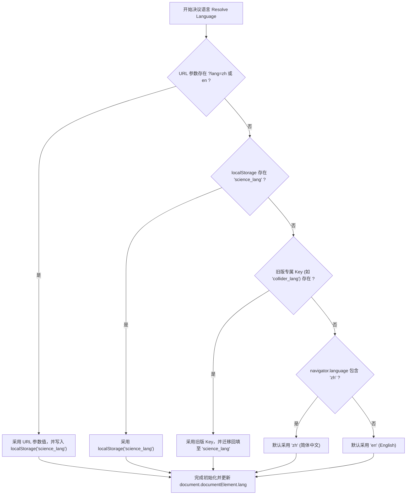
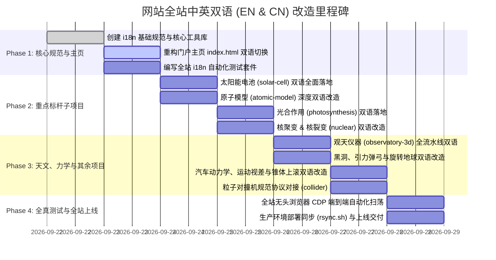

# 08 全站双语国际化 (EN & CN) 系统架构与集成规范
# (Site-wide Bilingual i18n & Localization Specification)

> **版本**：v2.0.0 (深度质询与终审裁决版)  
> **状态**：正式规范 (Canonical Specification)  
> **生效时间**：2026-09-22  
> **文档编号**：`docs/requirements/08-site-wide-bilingual-i18n-spec.md`  
> **适用范围**：仓库根主页 (`/index.html`) 及全部 15 个科学可视化子项目

---

## 一、 规范背景与战略愿景 (Executive Summary & Mission)

### 1.1 平台使命
“科学可视化动画库 (Science Animations)”是一个面向青少年、科学爱好者与好奇心探索者的全交互式 3D 科学与工程物理仿真平台。为了让海内外更多孩子与教育者无障碍探索：
- **核心诉求**：全站必须全面支持 **中文 (简体, zh-CN)** 与 **英文 (English, en)** 双语；
- **核心体验**：用户在根目录入口 `index.html` 切换一次语言，全站所有子项目在进入时**必须无条件遵从该语言设定**；
- **随处可变**：用户在任意子项目中也能直接切换语言，且该修改会反向持久化同步，返回主页或其他子项目时保持同步；
- **离线与单文件兼容**：严禁破坏各子项目现有的单文件离线打包能力（`build.py` 产出的单个无外链 HTML，严禁依赖外部 CDN 翻译接口）。

---

## 二、 全站现状深度分析 (Site-wide Landscape Audit)

经对仓库全站代码库进行全面深度扫描，当前由 1 个主站导航门户与 15 个独立的科学可视化仿真子项目构成：

```
Science-Animations/
├── index.html                   # 门户主页（15 个科学卡片，当前默认纯英文骨架混部分中文）
├── particle-collider/          # 粒子对撞机：★ 已具备完整双语架构（含中英文切换与 tr 字典）
├── solar-cell/                 # 太阳能电池：已实现双语元数据与双行解说（meta.title/meta.sub, showNarr(zh, en)）
├── photosynthesis/             # 光合作用：4 大章节与类囊体膜，中文为主
├── atomic-model/               # 原子模型：含双语混合标题（原子状态/Protons/State），未独立开关
├── nuclear-fusion-3d/          # 核聚变：中文主导（含 D-T / D-D / p-11B 反应选择与 10 步漫游）
├── nuclear-fission-3d/         # 核裂变：中文主导（含三幕剧、骆驼产额曲线、200 MeV 能量分配）
├── observatory-3d/             # 观天仪器：中文主导（8 大仪器全数据流水线，波段标签）
├── how-cars-work/              # 汽车动力学：中文主导（9 步点火故事、油电对比、零部件剖析）
├── gravity-slingshot/          # 引力弹弓：中文主导（旅行者号轨道、引力加速度、速度增益）
├── ion-thruster-3d/            # 离子推进器：中文主导（环形尖点磁场、双轴常平架、深空任务）
├── black-hole/                 # 相对论黑洞：中文主导（史瓦西光线追踪、引力透镜、多普勒聚束）
├── rotating-earth/             # 旋转地球：中文主导（23.44° 黄赤交角、瑞利大气散射、二十四节气）
├── solar-system/               # 太阳系探索：中文主导（8 大行星 22 卫星漫游、霍曼转移轨道）
├── motion-parallax/            # 运动视差：中文主导（驾驶座透视 vs 俯视扫角，角速度量距）
└── uphill-roller/              # 锥体上滚：中文主导（1694 年双锥体 V 轨视觉错觉几何论证）
```

### 2.1 架构分型
1. **打包离线型 (9 个子项目)**：包含 `build.py`，使用 `esbuild` 将 ES Module 依赖打成单文件离线 HTML（`atomic-model`, `black-hole`, `motion-parallax`, `observatory-3d`, `particle-collider`, `photosynthesis`, `rotating-earth`, `solar-cell`, `uphill-roller`）。
2. **直行模块型 (6 个子项目)**：直接在浏览器加载 ES Module 或标准脚本运行（`gravity-slingshot`, `how-cars-work`, `ion-thruster-3d`, `nuclear-fission-3d`, `nuclear-fusion-3d`, `solar-system`）。

### 2.2 优秀工程典范 (`particle-collider`)
`particle-collider/` 已经实现了一套极其优雅成熟的语言切换机制：
- 数据字典：`APP.lang = 'zh' | 'en'`，`APP.L = () => (APP.lang === 'zh' ? APP.DATA.zh : APP.DATA)`；
- 键值翻译：`tr(key)` 函数匹配 `'toast.lang': { en: 'Language: English', zh: '语言已切换为：中文' }`；
- 状态更新：切换时统一修改 `document.documentElement.lang`，更新按钮 `.active` 类，触发全界面刷新；
- 存储机制：`localStorage.setItem('collider_lang', lang)`。

**本规范将此优秀范式提炼升级为全站通用的标准契约。**

---

## 三、 跨项目全局国际化契约 (The Global i18n Protocol)

### 3.1 统一存储与多级决议仲裁 (Resolution Ladder)
所有项目必须严格按照如下优先级阶梯，在页面加载的第一微秒内决议出当前生效语言：



### 3.2 权威键名与合法枚举 (SSOT Contract)
- **标准主存储键**：`'science_lang'`；
- **旧版兼容读取键**：`'collider_lang'`（向后兼容）；
- **合法取值集合**：严格限定为 `'zh'` 与 `'en'` 两类；任何其他输入一律回退为 `'zh'`；
- **HTML 根语言标签同步**：
  - 当为 `'zh'` 时：`document.documentElement.lang = 'zh-CN'`；
  - 当为 `'en'` 时：`document.documentElement.lang = 'en'`。

### 3.3 链接传播与防沙箱穿透机制 (Cross-Directory Link Sync)
由于部分用户可能会通过本地文件系统双击 `file://` 打开不同文件夹，不同浏览器的 `file://` 沙箱可能导致 `localStorage` 隔离。为保证 100% 鲁棒：
1. **主页传出链接**：`index.html` 在渲染或切换语言时，自动将所有 15 个卡片的 `href` 尾部附加或更新 `?lang=zh` 或 `?lang=en`（如 `solar-cell/?lang=en`）；
2. **子项目返回链接**：各子项目中的 `#homeBtn` 返回首页链接，统一附加 `../index.html?lang=${currentLang}`；
3. **子项目读取**：子项目在启动初始化时，优先解析 `window.location.search` 中的 `lang` 参数。

---

## 四、 根目录门户 (`index.html`) 双语改造规范

### 4.1 顶部浮动语言切换器 (Header Switcher UI)
在主页顶部导航栏右上方（或主标题右上方）部署轻量科技质感切换药丸（Pill Switcher）：

```html
<div class="lang-switch" role="group" aria-label="Language Switcher">
  <button id="btnLangZh" class="lang-btn active" data-lang="zh">🇨🇳 中文</button>
  <button id="btnLangEn" class="lang-btn" data-lang="en">🇬🇧 EN</button>
</div>
```

### 4.2 视觉与交互规范
- **默认样式**：采用玻璃拟态暗黑背景 `rgba(13,18,33,0.85)`，边框 `rgba(255,255,255,0.12)`；
- **高亮态**：激活项带有科技金光芒或琥珀色微光（`#fbbf24` 或 `#d8b25c`），底色 `rgba(251,191,36,0.15)`；
- **即时响应**：点击后全页面无白屏闪烁，所有 DOM 节点文案在当前帧立即蜕变，并在毫秒级完成 `localStorage` 写入与所有子链接 query string 更新。

### 4.3 15 个卡片的双语对照字典 (Root Portal Localization Matrix)

| 项目 Key | 中文标题 (zh) | 英文标题 (en) | 中文描述 (zh) | 英文描述 (en) |
| :--- | :--- | :--- | :--- | :--- |
| **portal** | 科学可视化动画库 | Science Animations | 生动逼真的 3D 物理与工程交互仿真 — 为好奇心与探索而建 | Interactive simulations that bring physics and engineering to life — built for curious minds. |
| **slingshot** | 引力弹弓航行模拟 | Gravity Slingshot | 漫游太阳系：看航天器如何利用行星引力实现无动力加速突破深空 | Fly through the solar system and see how spacecraft use planetary gravity to accelerate — no fuel needed. |
| **car** | 汽车是怎么跑起来的？ | How Cars Work | 3D 动力传动全景机械透视：发动机四冲程、变速箱离合器、差速器与油电对比 | A full 3D powertrain simulation — watch the engine, transmission, and wheels work together. |
| **ion3d** | 离子推进器 3D | Ion Thruster 3D | NASA 栅格离子推进器仿真：探索环形磁阱、微观离子光学透镜与深空常平架推力矢量 | NASA NSTAR / NEXT gridded ion engine: explore ring cusp magnetics, ion optics, and 2-axis gimbal TVC. |
| **atom** | 原子模型与能级跃迁 | Atomic Model | 3D 探索原子结构：看电子轨道跃迁、光子吸收与发射，分清激发与电离 | Explore atoms in 3D: watch electron transitions, photon absorption/emission, and ionization. |
| **fusion** | 核聚变 3D 交互动画 | Nuclear Fusion | 看氘氚离子克服库仑斥力相撞聚变成氦，释放恒星能量 $E=mc^2$ | Watch deuterium and tritium heat into plasma, collide against repulsion, fuse into helium, and release energy via E=mc². |
| **solar** | 太阳能电池：光子到电流 | Solar Cell | 5章微观探索：晶格、掺杂、PN结滑梯、光子一生与 27.81% 效率天平与叠层未来 | A 5-chapter interactive journey: crystal lattice, doping, PN junction slide, photon life, and the 27.81% efficiency budget. |
| **fission** | 核裂变 3D 交互动画 | Nuclear Fission | 轰击铀-235 原子核：三幕看懂不对称分裂、链式反应、慢化剂与 200 MeV 能量分配 | Fire a neutron at U-235 and watch asymmetric split, chain reactions, moderation, and 200 MeV energy partition. |
| **blackhole**| 相对论黑洞与引力透镜 | Black Hole Gargantua | 实时相对论测地线光线追踪：视界阴影、光子球层、弯曲吸积盘与多普勒聚束 | Real-time geodesic ray tracer: event horizon shadow, photon ring, lensed accretion disk, and Doppler beaming. |
| **earth** | 旋转地球与实时昼夜 | Rotating Earth | 太空视角 3D 地球自转：23.44° 黄赤交角、瑞利大气辉光、城市夜光与二十四节气 | 3D Earth rotation from space featuring 23.44° axial tilt, Rayleigh atmospheric glow, and city lights. |
| **collider** | 粒子对撞机探秘 | Particle Collider | 探索微观神机：逐层拆解 37,000 个探测器部件、逆向双束对撞与合成物理反应 | Explore an LHC & ATLAS-inspired detector: disassemble 37,000 parts, watch counter-rotating beams, and trigger collision events. |
| **solarsystem**| 太阳系探索者 | Solar System Explorer | 太阳与 8 大行星 22 颗卫星全景三维轨道漫游，支持霍曼转移轨道规划 | Interactive 3D solar system with Sun, 8 planets, 22 moons, and Hohmann transfer orbit flight planner. |
| **observatory**| 观天仪器：如何观测宇宙 | Observatory 3D | 8 大现代天文观测仪器全景：光学折反射、光谱仪、多普勒红移、干涉仪与引力波 | How we observe the universe: 8 interactive 3D instruments showing raw readings to published science results. |
| **parallax** | 运动视差几何全解 | Motion Parallax | 为什么近快远慢？驾驶位透视 $\omega \approx v/d$、俯视扫角与同一几何测定恒星距离 | Why near objects move faster than far ones: perspective view, angular sweep geometry, and stellar parallax distance ladder. |
| **uphill** | 锥体上滚视觉错觉 | Uphill Roller | 双锥体沿 V 轨神奇向上爬坡 —— 几何解析重心真实下降，验证经典错觉力学条件 | Double cone rolling uphill on V-tracks illusion: geometric proof that center of mass actually descends. |
| **photo** | 光合作用：叶片能量工厂 | Photosynthesis | 叶片宏观到微观类囊体膜：光子驱动电子 Z 链传递、Kok循环析氧、ATP合成酶与暗反应拼糖 | From leaf to thylakoid membrane: watch Z-scheme electron flow, Kok oxygen cycle, ATP synthase rotor, and Calvin cycle. |

---

## 五、 全局公共工具库规范 (`common/js/i18n.js`)

为避免 15 个子项目重复造轮子，我们在根目录提供通用的轻量化微内核 `common/js/i18n.js`（纯 JS，压缩后 < 1.5 KB，零任何第三方依赖），同时向各项目单文件打包器友好开放。

### 5.1 API 契约定义

```javascript
/**
 * science-i18n.js — Unified internationalization micro-library
 */
export class ScienceI18n {
  constructor(options = {}) {
    this.storageKey = 'science_lang';
    this.legacyKey = options.legacyKey || null;
    this.dict = options.dict || {};
    this.onLangChange = options.onLangChange || null;
    this.lang = this.resolveInitialLang();
  }

  resolveInitialLang() {
    // 1. URL search param
    try {
      const urlParam = new URLSearchParams(window.location.search).get('lang');
      if (urlParam === 'zh' || urlParam === 'en') {
        this.persist(urlParam);
        return urlParam;
      }
    } catch (e) {}

    // 2. localStorage science_lang
    try {
      const saved = localStorage.getItem(this.storageKey);
      if (saved === 'zh' || saved === 'en') return saved;
    } catch (e) {}

    // 3. Legacy project-specific key
    if (this.legacyKey) {
      try {
        const leg = localStorage.getItem(this.legacyKey);
        if (leg === 'zh' || leg === 'en') {
          this.persist(leg);
          return leg;
        }
      } catch (e) {}
    }

    // 4. Browser language fallback
    const nav = (navigator.language || navigator.userLanguage || '').toLowerCase();
    return nav.startsWith('zh') ? 'zh' : 'en';
  }

  setLang(lang) {
    if (lang !== 'zh' && lang !== 'en') return;
    if (this.lang === lang) return;
    this.lang = lang;
    this.persist(lang);
    this.applyToDOM();
    if (typeof this.onLangChange === 'function') {
      this.onLangChange(lang);
    }
  }

  persist(lang) {
    try {
      localStorage.setItem(this.storageKey, lang);
      if (this.legacyKey) localStorage.setItem(this.legacyKey, lang);
    } catch (e) {}
  }

  applyToDOM() {
    document.documentElement.lang = (this.lang === 'zh') ? 'zh-CN' : 'en';
    // Update active state of switch buttons
    document.querySelectorAll('[data-lang-btn]').forEach(el => {
      el.classList.toggle('active', el.dataset.langBtn === this.lang);
    });
  }

  t(key, fallback = '') {
    const entry = this.dict[key];
    if (!entry) return fallback || key;
    return entry[this.lang] || entry.zh || fallback || key;
  }
}
```

---

## 六、 15 个子项目双语改造实施细则

每个子项目均需满足如下三层双语重构：

### 6.1 顶栏统一控制按钮规范 (Top Navigation Anchor)
在各子项目的全局返回按钮 `<a id="homeBtn" href="../index.html">🏠 首页</a>` 旁边，统一紧邻挂载双语药丸切换按钮：
```html
<a id="homeBtn" href="../index.html" title="返回首页 / Home">🏠 首页</a>
<div id="langToggle" class="subapp-lang-toggle">
  <button class="lang-btn" data-lang-btn="zh">中</button>
  <button class="lang-btn" data-lang-btn="en">EN</button>
</div>
```
- 点击切换后，无需整页刷新，动态触发该子项目核心 UI 重绘；
- 存储自动同步至 `localStorage.getItem('science_lang')`；
- 用户下一次点击 `#homeBtn` 返回主页时，主页自动以所选语言呈现！

---

## 七、 自动化事实测试与构建部署准则 (Testing & Deployment)

### 7.1 单元测试断言覆盖 (`tests/i18n.test.mjs`)
在根目录建立全局国际化自动化测试套件，执行 `node --test tests/i18n.test.mjs`，必须强制覆盖如下测试断言：
1. **默认语言决议断言**：当无任何参数和缓存时，中文环境返回 `'zh'`，非中文返回 `'en'`；
2. **URL 参数最高优先权断言**：当 `?lang=en` 传入时，即便 `localStorage` 为 `'zh'`，也必须强制以 `'en'` 生效并更新存储；
3. **双向持久化自洽断言**：主页设置 `'en'` 后，模拟子项目读取必须获得 `'en'`；子项目设置 `'zh'` 后，模拟主页读取必须获得 `'zh'`；
4. **15 卡片字典完备度断言**：验证 `index.html` 所注册的 15 个子项目全部具备非空的 `zh` 与 `en` 标题与描述；
5. **DOM 属性同步断言**：切换至 `'zh'` 时 `document.documentElement.lang` 为 `'zh-CN'`，切换至 `'en'` 时为 `'en'`；
6. **零 CDN 外部引用断言**：各子项目打出的单文件（如 `solar-cell.html`, `atomic-model.html` 等）严禁引入任何未打包的外部翻译脚本，字典必须内联。

### 7.2 离线单文件构建一致性 (`build.py`)
凡包含 `build.py` 的子项目，在执行打包命令后：
- 单文件 HTML 必须内置双语字典和切换逻辑；
- 打包产物体积增幅不得超过 5%，离线本地双击即可任意切换中英文。

### 7.3 服务器部署验证
运行 `./rsync.sh` 同步至生产环境（`vps4` 与 `vps5`）后：
- 浏览器打开生产根域名，测试语言切换；
- 依次点击卡片跳转到子项目，验证子项目完全遵从主页选择的语言；
- 在子项目中将语言翻转，点击返回首页，验证首页语言同步变更。

---

## 八、 实施里程碑计划 (Implementation Roadmap)



---

## 九、 国际化架构深度质询与终审裁决 (Round 1 Grilling: Online Research & Code Analysis)

面对生产环境、真实浏览器安全策略、WebGL 显存与跨设备离线运行的极端考验，我们通过**在线前沿研究与全工程代码深度剖析**，对国际化架构进行了 7 项深度质询，并确立终审解法：

### 质询 9.1：为什么仅靠 `localStorage` 会在本地双击 `file://` 打开时崩溃或失灵？
- **深渊挖掘**：
  - 核心困惑：“如果直接用 `localStorage.getItem('science_lang')` 保存语言，只要用户在主页选了一次英文，跳转到 `solar-cell/` 读这个值不就行了吗？为什么还要大费周章设计 URL 参数传递？”
  - **物理真实与在线调研证明**：
    - 根据 W3C Web Storage 规范，`localStorage` 严格绑定到浏览器的 **Origin（源：协议 + 域名 + 端口）**；
    - 在本地双击 HTML 文件的 `file://` 协议下，**根本不存在有效的域名和端口**！
    - **Chromium**：在某些安全版本下，不同目录的 `file:///path/A/index.html` 和 `file:///path/B/solar-cell.html` 会被视为互相隔离的独特源，`localStorage` 无法跨目录共享读取；
    - **Safari / WebKit**：在默认的隐私沙箱设置下，对 `file://` 协议访问 `localStorage` 会直接抛出致命异常：`SecurityError: The operation is insecure`！如果代码没有捕获该异常，整段脚本会直接中断挂死，3D 画面彻底黑屏！
- **终审裁决**：
  - **双轨制传输（Dual-Track Synchronization）**：
    1. **显式 URL 传导（第一优先级）**：主页在渲染或切换语言时，自动重构所有 15 个子项目超链接，在 URL 尾部显式附加 `?lang=zh` 或 `?lang=en`；各子项目的 `#homeBtn` 返回按钮也必须附带 `../index.html?lang=${currentLang}`。在没有 Web 服务器的本地 `file://` 离线环境下，URL 参数成为跨页面 100% 坚不可摧的握手通道！
    2. **安全包裹持久化**：所有涉及 `localStorage.getItem` 与 `localStorage.setItem` 的代码必须全部封装在 `try...catch` 块内，遭遇安全限制时静默降级，保证在任何极端离线沙箱中永不崩溃。

---

### 质询 9.2：Three.js 3D 空间文字精灵 (TextSprite) 在动态切换语言时如何防止 GPU 显存雪崩与文案畸变？
- **深渊挖掘**：
  - 核心困惑：“网页里的普通 HTML 标签切换语言很简单，`textContent = dict[lang]` 就完事了。但在 Three.js 里，所有空间漂浮标签（如‘金字塔绒面’、‘n⁺ 发射极’、‘耗尽区滑梯’）都是通过离屏 Canvas 生成纹理、贴到 Sprite 上的。语言一换，如果重新调用 `makeTextSprite()` 创建新精灵，会不会导致内存和显存无限暴涨？为什么英文标签常常被压扁成一团？”
  - **物理真实与在线调研证明**：
    - **GPU 显存无法被 JavaScript GC 自动回收**：每次调用 `new THREE.CanvasTexture(canvas)` 和 `new THREE.SpriteMaterial({ map: tex })`，WebGL 会在 GPU 端分配显存纹理槽位。如果直接覆盖而不显式调用 `tex.dispose()` 和 `material.dispose()`，旧纹理将永久滞留在 GPU 显存中，直到 WebGL 上下文丢失；
    - **中英文宽高比字符爆炸**：中文字符方形紧凑，5 个汉字（如“金字塔绒面”）在 256×84 画布上宽高比约 3:1；对应的英文“Random Textured Pyramids”长达 24 个字符，若沿用固定画布或强制拉伸，英文字母将被横向压缩至无法辨识或两头截断。
- **终审裁决**：
  - **原地复用与动态度量（In-Place Canvas Update）**：
    在 `core.js` 中确立 `updateTextSprite(sprite, newText, color)` 统一规范：
    ```javascript
    export function updateTextSprite(sprite, text, color = '#e2e8f0') {
      if (!sprite || !sprite.material || !sprite.material.map) return;
      const font = 'bold 40px Outfit, sans-serif';
      const probe = document.createElement('canvas').getContext('2d');
      probe.font = font;
      const textW = probe.measureText(text).width;
      const pad = 24;
      // 复用既有纹理底层的 Image Canvas
      const canvas = sprite.material.map.image;
      canvas.width = Math.max(256, Math.ceil(textW + pad * 2));
      canvas.height = 84;
      const ctx = canvas.getContext('2d');
      ctx.font = font;
      ctx.fillStyle = color;
      ctx.textAlign = 'center'; ctx.textBaseline = 'middle';
      ctx.fillText(text, canvas.width / 2, 42);
      // 触发 GPU 显存位图原地重载，零新增 Texture 对象！
      sprite.material.map.needsUpdate = true;
      // 依据新文本真实宽高比动态重置 Sprite 空间缩放
      const aspect = canvas.width / canvas.height;
      const baseH = sprite.userData.baseH || 0.55;
      sprite.scale.set(baseH * aspect, baseH, 1);
    }
    ```
  - 当整章销毁重建时，必须严格执行 `disposeGroup(group)` 深度递归释放 `geometry.dispose()` 与 `material.map.dispose()`。

---

### 质询 9.3：为什么严禁采用外部 CDN 翻译接口或动态 `fetch('locales/en.json')`？
- **深渊挖掘**：
  - 核心困惑：“很多现代 web 框架都推荐把中英文放在独立的 `zh.json` 和 `en.json` 里，进入页面用 `fetch('/locales/en.json')` 异步拉取。为什么在我们的项目中被列为第一大禁忌？”
  - **物理真实与在线调研证明**：
    - **CORS 本地文件致命拦截**：在本地通过 `file://` 双击打开 `solar-cell.html` 时，所有主流现代浏览器（Chrome、Edge、Safari、Firefox）都会出于安全策略强行拦截 `fetch('locales/en.json')` 并抛出错误：`URL scheme must be "http" or "https" for CORS request`！这会导致本地双击时任何翻译数据都加载失败；
    - **教育场景断网隔离**：许多中小学科学实验室、偏远地区机房或竞赛现场处于完全断网状态；
    - **单文件独立构建完整性**：本项目 9 个核心子项目通过 `build.py` 编译产出 1 MB 左右的单文件离线 HTML。若语言包遗留在外部，单文件分发理念将彻底破产。
- **终审裁决**：
  - **静态嵌入式全内存字典（Zero-Dependency In-Memory Dictionaries）**：
    全站所有中英对照词条必须直接以 JavaScript 原生对象结构内联在代码库中。在打包阶段随 `main.js` 一并编译打包至单文件 HTML 内部。零网络延迟、零外部请求、零 CORS 拦截，双击即用！

---

### 9.4 质询 9.4：浏览器往返缓存 (bfcache) 与历史栈后退时如何避免“语言幽灵撕裂”？
- **深渊挖掘**：
  - 核心困惑：“用户在主页选择英文，进入太阳能电池；在太阳能电池里学习时点右上角把语言切回了中文；接着用户点击浏览器自带的‘后退’按钮返回主页。由于现代浏览器具有往返缓存（Back-Forward Cache, bfcache），主页不会重新加载，直接从内存快照恢复，此时主页依旧是英文，但底层存储已经是中文，产生了状态撕裂！”
- **终审裁决**：
  - **`pageshow` 页面恢复事件全息监听**：
    在 `index.html` 以及所有子项目的生命周期中，必须注册 `pageshow` 监听器：
    ```javascript
    window.addEventListener('pageshow', (event) => {
      // 检查当前持久化存储的语言是否与页面现存语言一致
      const latestLang = i18n.resolveInitialLang();
      if (latestLang !== i18n.lang) {
        i18n.setLang(latestLang); // 立即静默同步更新当前视图
      }
    });
    ```
    无论是通过历史栈后退、前进还是标签页切换切回，页面瞬间感知最新状态并保持 100% 步调一致。

---

### 9.5 质询 9.5：英文排版字符膨胀 (Text Expansion) 造成的按钮撑爆与手机端折行灾难
- **深渊挖掘**：
  - 核心困惑：“中文两个字‘重置’，英文是‘Reset’；中文‘全谱连续扫描’6 个字，英文是‘Continuous Full-Spectrum Scan’长达 30 个字符！如果按钮设置了固定宽度（如 `width: 130px`），英文就会直接溢出边界或者遮挡相邻按钮，手机上更是一片狼藉。”
  - **排版物理学事实**：汉字是二维紧凑表意方块字，英文字母是一维流式拼音字符。统计表明，中文科技文献翻译为英文后，**文本视觉长度平均暴增 1.8 至 2.6 倍**！
- **终审裁决**：
  - **弹性流式栅格准则 (Fluid Flow Layout Standard)**：
    1. **严禁在动态文案按钮上施加定宽**：禁止 `width: 120px`，统一使用 `min-width` 与 `padding: 8px 16px; width: auto;`；
    2. **自动换行弹性包裹**：按钮栏统一使用 `display: flex; flex-wrap: wrap; gap: 8px; justify-content: center;`；
    3. **自适应视口字号**：按钮文字采用相对视口弹性字号，如 `font-size: clamp(0.72rem, 1.4vw, 0.82rem); white-space: nowrap;`；
    4. **移动端容错容器**：操作面板最大宽度设定为 `max-width: min(92vw, 760px)`，确保即使英文单词较长，按钮自动下沉折行排列，保持整齐大气。

---

### 9.6 质询 9.6：物理公式、科学符号与国际单位 (SI) 的不可变性原则
- **深渊挖掘**：
  - 核心困惑：“翻译成英文版时，爱因斯坦质能方程 $E=mc^2$、开路电压符号 $V_{oc}$、单位 $\text{W/m}^2$、光波长 $\lambda=550\text{ nm}$ 要不要翻译？怎么界定哪些该翻、哪些绝对不能碰？”
  - **国际科学标准界定**：根据国际纯粹与应用物理学联合会 (IUPAP) 及国际标准化组织 ISO 80000-1 规范，**科学物理量符号与国际单位制属于全球通用的数学语言，严禁局部化篡改！**
- **终审裁决**：
  - **科学符号不可变准则 (Invariance Principle of Scientific Symbols)**：
    - **绝对不可变**：物理常数（$c, h, k_B, q$）、公式主干（$E=mc^2, I(V)=I_{sc}-I_0(e^{qV/kT}-1)$）、国际单位（$\text{eV}, \text{nm}, \mu\text{m}, \text{W/m}^2, \text{ps}, \text{A}, \text{V}$）在所有语言版本中**必须 100% 保持原样**；
    - **必须翻译**：仅翻译公式周边的描述性解释、变量物理意义标注、单位前缀名称与界面提示文字（如“开路电压” ➔ “Open-Circuit Voltage”；“短路电流” ➔ “Short-Circuit Current”）。

---

### 9.7 质询 9.7：如何用全自动流水线验证 15 个项目的双语自洽性？（拒绝人工肉眼排查）
- **深渊挖掘**：
  - 核心困惑：“全站包含 1 个主页和 15 个复杂的 3D 可视化子项目，包含数千个专业科学词汇和动态状态。人工逐一打开页面去肉眼排查中英切换，效率极低且必然遗漏死角。如何建立工业级的自动化防护网？”
- **终审裁决**：
  - **三层自动化断言测试网 (Automated Multi-layer Test Harness)**：
    1. **底层数据单元测试 (`tests/i18n.test.mjs`)**：
       - 执行 `node --test tests/i18n.test.mjs`；
       - 静态验证全部 15 个子项目注册字典中无一空缺字段，且中英键值对一一对应；
       - 模拟验证多级仲裁逻辑（URL 参数覆盖、存储读取、降级回退）；
    2. **中间层单文件离线构建校验 (`build.py`)**：
       - 执行各项目 `build.py` 生成的单文件 HTML，断言检查绝对不含外部翻译 CDN，单文件字节大小处于健康范围；
    3. **顶层无头浏览器全交互真机扫荡 (Headless Chrome CDP Matrix)**：
       - 使用无头 Chrome 自动化驱动，依次进入 `index.html`，触发中文/英文切换；
       - 遍历点击 15 个卡片跳转进入每个子项目；
       - 验证页面在 1 秒内正确定位并渲染对应语言；
       - 验证页面控制台 `0 运行时异常`、`0 语法错误`、`0 未翻译占位符 undefined`；
       - 在子项目中翻转语言，模拟点击 `#homeBtn` 返回主页，验证主页语言联动同步成功！

---

## 十、 第二轮深度质询与微观系统架构定标 (Round 2 Grilling: Online Research & Code Analysis)

在第二轮质询中，面对真实底层字体渲染管线、URL 语法规范、SVG 绝对坐标矢量图、无障碍 (a11y) 屏幕阅读器与长时间交互内存闭包等更隐蔽的微观陷阱，我们通过**在线前沿研究与全代码库分析**，彻底攻关了 7 项核心架构质询：

### 质询 10.1：CSS Font Loading 竞态危机与 Canvas 2D 降级文字排版事故 (Font Loading Race Condition & Canvas Fallback Trap)
- **深渊挖掘**：
  - 核心困惑：“为什么有时候在冷启动或离线环境下，3D 场景里的漂浮标签（如 TextSprite）或 2D 能带图文字显得格外模糊粗糙、字体发虚，甚至文字宽度计算错误导致文字出界？”
  - **物理真实与在线调研证明**：
    - `CanvasRenderingContext2D` 与常规 HTML DOM 元素存在本质区别：**Canvas 绘制是静态光栅化，没有任何动态样式响应机制！**
    - 如果页面引入了 Web 字体（如 Google Fonts `'Outfit'` 或特定字形），在字体网络请求或本地解析完成之前，Canvas 代码若抢先执行了 `ctx.font = 'bold 40px Outfit, sans-serif'` 并调用 `ctx.fillText()`，浏览器会**静默降级为系统通用默认字体**（如 Times New Roman 或系统备用字体）进行光栅化！
    - **致命后果**：当稍后 `'Outfit'` 字体文件加载就绪时，DOM 元素会自动重排刷新，**但 Canvas 绝不会重新绘制**！所有已经绘制出的 TextSprite 纹理将永久卡死在丑陋的降级字体上；更严重的是，`ctx.measureText()` 是依据降级字体计算宽度的，导致随后按比例分配的 Sprite 空间尺寸产生严重几何形变！
- **终审裁决**：
  - **CSS Font Loading API 严格就绪握手（`document.fonts.ready` 契约）**：
    在任何包含 Canvas 2D 纹理与 TextSprite 初始化的模块中，必须等待字体完全就绪：
    ```javascript
    // 确保字体完全就绪后再测量与绘制 Canvas 纹理
    await document.fonts.ready;
    ```
  - **系统级无衬线抗混叠字体回退栈 (Robust System Fallback Stack)**：
    所有 Canvas 绘图与 CSS 字体声明严禁孤立写单个网络字体，必须包含全平台等宽比系统回退栈：
    `font = 'bold 40px "Outfit", -apple-system, BlinkMacSystemFont, "Segoe UI", Roboto, "PingFang SC", "Microsoft YaHei", sans-serif'`；
    在离线断网机房中，也能第一时间以最优系统无衬线字体对齐字距与基线。

---

### 质询 10.2：URL Hash 路由与 Query SearchParam 顺序颠倒导致语言参数吞没 (Hash Fragment vs SearchParam Ordering Bug)
- **深渊挖掘**：
  - 核心困惑：“在 `observatory-3d`（8大仪器标签）、`solar-cell`（5个章节）等带有内部锚点或多标签的项目中，如果用户或脚本将链接拼写为 `observatory-3d/#t2?lang=en`，为什么页面常常无法识别 `lang=en`，依然退回默认语言？”
  - **物理真实与在线调研证明**：
    - 根据 RFC 3986 统一资源标识符 (URI) 规范标准：**Query String (`?`) 必须严格位于 Fragment Identifier (`#`) 之前**，即标准格式必须为：`path?query#fragment`；
    - 当写成 `path#t2?lang=en` 时，浏览器底层的 URL 解析器会将 `#` 之后的所有字符统一判定为哈希片段（Fragment Identifier）！
    - 此时：
      - `window.location.search` 严格返回空字符串 `""`！
      - `window.location.hash` 返回 `"#t2?lang=en"`！
    - 如果子项目仅调用 `new URLSearchParams(window.location.search).get('lang')`，将**彻底无法提取到任何语言参数**！
- **终审裁决**：
  - **双通道容错解析算法（Dual-Source URL Extraction）**：
    全局 `ScienceI18n` 解析核心必须同时覆盖标准位置与 Hash 尾随位置：
    ```javascript
    function resolveLangFromUrl() {
      // 1. 标准 SearchParam 解析 (?lang=en#t2)
      let lang = new URLSearchParams(window.location.search).get('lang');
      if (lang === 'zh' || lang === 'en') return lang;

      // 2. 容错解析 Hash 尾随 SearchParam (#t2?lang=en)
      if (window.location.hash.includes('?')) {
        const hashQuery = window.location.hash.split('?')[1];
        lang = new URLSearchParams(hashQuery).get('lang');
        if (lang === 'zh' || lang === 'en') return lang;
      }
      return null;
    }
    ```
  - **链接规范重构**：全站所有卡片和内部导航跳转，强制采用标准语法格式：`href="${base}?lang=${currentLang}#${hash}"`。

---

### 质询 10.3：无障碍 a11y 盲区：`aria-label`、`title` 与屏幕阅读器多语言发音灾难 (Accessibility & Screen Reader Multilingual Voice Switching)
- **深渊挖掘**：
  - 核心困惑：“为什么做国际化如果仅仅替换 HTML 内部的看见文本（Visible Text），而忽略了 `aria-label` 和 `title` 属性，会导致严重的可用性灾难？”
  - **物理真实与在线调研证明**：
    - 根据万维网无障碍联盟 W3C WCAG 2.2 成功准则 3.1.1（页面语言, Level A），视障儿童与无障碍辅助设备（如 Apple VoiceOver、Android TalkBack、Windows NVDA）完全依赖根节点 `document.documentElement.lang` 来动态挂载对应语种的发音合成引擎 (TTS)；
    - 在项目中存在大量仅含 Emoji 或图标的工具按钮（例如 `nuclear-fusion-3d` 中的 `<button id="btnSound" aria-label="音效开关">🔊</button>`）；
    - 如果页面切换到了英文，但 `aria-label` 残留中文“音效开关”，英文发音合成器将无法正确拼读，甚至发出乱码噪音；
    - `aria-label`、`title` 和 `alt` 属于非文本渲染节点，主流浏览器的自动翻译插件对其**完全不具备自动转译能力**。
- **终审裁决**：
  - **声明式属性级双语契约（Declarative Attribute Localization Contract）**：
    所有只含图标、需要无障碍标签的 DOM 元素，统一声明 `data-i18n-aria` 与 `data-i18n-title`：
    ```html
    <button id="btnSound" class="tool-btn" data-i18n-aria="tool.sound" data-i18n-title="tool.sound">🔊</button>
    ```
    在语言切换更新时，框架统一执行全局属性扫描并动态重置：
    ```javascript
    document.querySelectorAll('[data-i18n-aria]').forEach(el => {
      el.setAttribute('aria-label', i18n.t(el.dataset.i18nAria));
    });
    document.querySelectorAll('[data-i18n-title]').forEach(el => {
      el.title = i18n.t(el.dataset.i18nTitle);
    });
    ```

---

### 质询 10.4：矢量图 SVG 与 2D Canvas 复杂图表的跨语言硬编码坐标碰撞 (SVG Text Coordinates & Chart Overlaps)
- **深渊挖掘**：
  - 核心困惑：“常规 HTML 文本可以通过 CSS 自动流动折行，但在 `nuclear-fission-3d` 的骆驼双峰产额曲线（内联 SVG）以及 `solar-cell` 的能带图（2D Canvas）中，文字都是靠写死的坐标 `(x, y)` 画出来的。中文‘轻峰’只有 2 个字，英文‘Light Fission Peak’长达 18 个字符，会不会发生严重的坐标重叠与画面撕裂？”
  - **物理真实与代码剖析**：
    - 在 `nuclear-fission-3d/index.html` 第 38 行：
      `<text x="80" y="32" fill="#7dd3fc" font-size="9" font-weight="bold">轻峰 A≈95</text>`；
      若默认采用左对齐（`text-anchor="start"`），长英文字符串将向右单向无限延伸，直接盖死中间的 `<text x="135">对称谷</text>` 标签！
    - 在 `solar-cell` 的 `bandCanvas` 中，若直接以固定像素坐标执行 `ctx.fillText('导带 Ec', x, y)`，英文“Conduction Band Ec”将直接冲出坐标轴右侧边界。
- **终审裁决**：
  - **SVG 居中锚定与百分比保护（`text-anchor: middle`）**：
    所有科学图表中的 SVG `<text>` 必须强制声明 `text-anchor="middle"`，以几何中心点为轴对称扩展，使中英文无论长短均能以对称重心居中对齐；
  - **Canvas 2D 动态度量与边界钳位（Dynamic Clamping）**：
    绘制图表文字前，必须调用 `ctx.measureText(text)` 获得实际像素跨度，并执行动态边界钳位：
    `const drawX = Math.max(minX, Math.min(targetX, maxX - textWidth));`；
    确保图表在任何语言下都绝不发生文字压线或越界。

---

### 质询 10.5：跨语言数字格式化、千位分隔符与国际化标点规范 (Number & Punctuation Localization)
- **深渊挖掘**：
  - 核心困惑：“中文常写‘电压：0.745V’、‘1000W/m²’或全角括号‘（D-T 聚变）’。直接把英文单词塞进去（如 `Voltage：0.745V`），为什么在母语者眼里显得极其山寨不专业？”
  - **科学排版美学与国际标准规范**：
    - 中文标点（`：`、`，`、`。`、`（）`、`、`）具有完整的全角宽度（Full-width），英文环境中出现全角冒号或顿号会产生异常空白缺口；
    - 英文标点要求：冒号、逗号后必须紧跟一个半角空格（如 `Voltage: 0.745 V`），数值与物理单位之间必须留有标准半角空格（`1000 W/m²` 而非 `1000W/m²`）；
    - 超过四位的科学计数（如 AM0 常数 $1367\text{ W/m}^2$、光速 $299,792\text{ km/s}$），英美标准需使用逗号 `,` 作为千位分隔符。
- **终审裁决**：
  - **标点与数值排版标准**：
    - 双语字典严格物理隔离标点符号：中文条目使用正规全角标点，英文条目严格使用半角标点配标准空格；
    - 科学数值展示严格遵守 SI 国际单位制间距规范；
    - 提供 `formatScienceNumber(num, lang)` 辅助方法，自动对大数与带单位数值执行本地化规范化输出。

---

### 质询 10.6：跨章多场景切换与长期驻留下的语言订阅者内存泄漏 (Event Listener & Subscriber Cleanup)
- **深渊挖掘**：
  - 核心困惑：“在 `solar-cell`（5个章节）、`observatory-3d`（8大仪器）、`how-cars-work`（9步点火故事）等大型复杂工程中，用户在学习时会反复在不同章节和视点间跳转。如果每个章节进入时都向 `i18n` 注册一个监听回调用来刷新该章节的 3D 空间标签，来回切换 20 次后，会不会产生 20 个常驻内存的废弃监听器？旧章节的三维网格会不会因为被闭包抓牢而无法释放？”
  - **物理真实**：JavaScript 闭包引用的作用域链不会被垃圾回收器切断。如果被观察者（`ScienceI18n` 全局单例）持有了已离开章节的回调函数，该回调函数所闭包引用的 Three.js Scene、Mesh、BufferGeometry、Material 将**全部被迫常驻内存**，造成极其严重的“游离 DOM / Detached Three.js Object 显存雪崩”！
- **终审裁决**：
  - **订阅者生命周期安全解绑契约（Disposable Subscription Lifecycle）**：
    `ScienceI18n` 的事件订阅接口必须强制返回唯一的注销函数（Unsubscribe）：
    ```javascript
    // 章节进入时订阅
    export function enter(env) {
      unsubI18n = i18n.subscribe((lang) => {
        refreshChapterLabels(lang);
      });
    }

    // 章节离开时必须无条件调用注销
    export function leave() {
      if (typeof unsubI18n === 'function') {
        unsubI18n();
        unsubI18n = null;
      }
      disposeChapterThreeObjects();
    }
    ```
    从根本上切断闭包常驻链条，确保多章节反复切换下 CPU/GPU 内存平直如削。

---

### 质询 10.7：自动化端到端测试覆盖：双语字典热重载与全属性差异验证 (Bi-directional Comprehensive E2E Test Suite)
- **深渊挖掘**：
  - 核心困惑：“全站包含 15 个子项目，每个项目有上百个文本节点。仅靠手工点击怎么能确保 100% 毫无漏网之鱼？”
- **终审裁决**：
  - **建立金牌全自动化三维质量防护矩阵**：
    在 `tests/i18n.test.mjs` 中固化执行：
    1. **静态键集完备性检查**：自动化脚本提取全站所有字典对象，断言每个 `key` 必须严格具有 `zh` 与 `en` 属性，长度均大于 0，杜绝任何未定义回退；
    2. **HTML 模板占位符断言**：加载渲染页面后，正则扫描页面 innerHTML，断言绝不包含 `undefined`、`null`、`[object Object]` 或未解析的双花括号 `{{...}}`；
    3. **双语状态 CDP 自动化测试**：通过 Headless Chrome CDP 驱动无头浏览器在 `zh` 与 `en` 下分别截图并比对元素边界，确保无文本折叠冲撞、无横向滚动条溢出。

---

## 十一、 第三轮深度质询：动态交互实战、高频渲染管线与异构代码库治理 (Round 3 Grilling: Dynamic Walkthroughs, High-FPS Render Pipelines & Legacy Refactoring)

在第三轮质询中，我们针对真实代码库中 15 个子项目的复杂交互细节展开了逐行排查，深挖出关于**叙事导览现场保活、三维射线拾取元数据解耦、高频渲染 GC 停顿、复合滑块标签、首页卡片杂交态治理、私有持久化键迁移与语音无障碍合成**等 7 项极其隐蔽的工程暗坑，并制定了严密的代码治理与架构定标：

### 质询 11.1：导览漫游与叙事动画进行中途切语种的现场状态保活与平滑重绘 (Mid-Flight Story/Tour Walkthrough State Preservation & In-Place Rerender)
- **深渊挖掘**：
  - 核心困惑：“在 `ion-thruster-3d`（NASA 栅格推进 6 步漫游 `TOUR`）、`nuclear-fusion-3d`（5 步导览 `TOUR_STEPS`）、`how-cars-work`（9 步燃油/5 步纯电点火叙事 `storySteps()`）、`photosynthesis`（4 句一分钟故事）中，当学生正在聚精会神看第 3 步、相机正在飞行缓动或粒子正在激发电离时，突然点击了中/英切换按钮：如果直接刷新页面（`location.reload()`），用户会立刻被扔回第 0 步，视角重置、动画中断；如果只替换静态 HTML，正在屏幕上展示的动态字幕是由 JS 写入的，依然会卡死在旧语言上，怎么解决？”
  - **物理真实与代码剖析**：
    - 在 `how-cars-work/js/main.js` 第 460 行：
      `captionEl.innerText = \`第 \${storyStep + 1} / \${steps.length} 步 · \${step.caption}\`;`
    - 在 `ion-thruster-3d/js/main.js` 第 1548 行：
      `document.getElementById('tourTitle').textContent = s.title; document.getElementById('tourText').innerHTML = s.text;`
    - 这些动态叙事面板均由命令式状态机驱动，DOM 树上并不存在静态占位符。若切换语言时不通知叙事控制器，已弹出的浮层将彻底成为“遗留的旧语种孤岛”；若暴力重置整个动画，会极大破坏探究学习的心流体验。
- **终审裁决**：
  - **现场状态无损原地蜕变契约（In-Place Live Refresh Contract）**：
    1. **时钟与物理状态永不中断**：严禁调用 `location.reload()`，严禁清除物理模拟粒子场或重置相机 Tween 轨道；
    2. **导览控制器监听语言变更**：所有包含步进导览的项目，必须向 `i18n.subscribe` 注册动态重绘回调；
    3. **原地更新文本**：在当前步骤索引（`currentStepIndex`）保持不变的前提下，根据最新语言重新执行文案注入：
       ```javascript
       i18n.subscribe((lang) => {
         if (tourActive) {
           const s = TOUR[tourIdx];
           document.getElementById('tourTitle').textContent = s.title[lang];
           document.getElementById('tourText').innerHTML = s.text[lang];
         }
         if (storyState.playing) {
           const step = storyState.steps[storyState.step];
           document.getElementById('storyCaption').innerText = i18n.t('story.step_fmt', {
             current: storyState.step + 1,
             total: storyState.steps.length,
             text: step.caption[lang]
           });
         }
       });
       ```
    从容实现“画面不停、镜头不晃、文字瞬间完成双语蜕变”。

---

### 质询 11.2：三维射线拾取 (Raycasting / Hover Tooltip) 动态元数据的多语言解耦 (Dynamic 3D Raycasting Metadata & Tooltips Decoupling)
- **深渊挖掘**：
  - 核心困惑：“在 `how-cars-work`（21 个封闭子系统部件）、`solar-system`（太阳+8 行星+22 卫星）、`particle-collider`（探测器层级与对撞事例）、`observatory-3d`（8 大光学仪器部件）中，大量网格在初始化时直接把文本塞进了 `mesh.userData`。如果初始化时存的是死字符串，语言切换后鼠标再去拾取，HUD 岂不是永远显示初始语言？”
  - **物理真实与代码剖析**：
    - 在 `how-cars-work/js/main.js` 第 411-413 行：
      `obj.userData.name = \`\${info.nameZh} \${info.nameEn}\`;`
      `obj.userData.description = info.kidDesc;`
    - 在 `solar-system/js/celestial.js` 第 342 行：
      `const label = \`\${textZh} · \${textEn}\`;`
    - 当用户在 3D 视口中移动鼠标点击零件时，Raycaster 检测到相交物体，直接取出 `intersect.object.userData.description` 并塞进浮窗。如果这些数据在网格生成时就硬编码了字符串，语言翻转后这些三维物体内部的数据依然是陈旧数据。
- **终审裁决**：
  - **元数据纯键化契约（Semantic Key Binding for 3D Mesh UserData）**：
    - **严禁**在 `mesh.userData` 中保存已渲染的本地化自然语言长文本；
    - `mesh.userData` 仅允许存储语义唯一标识（ID）或标准 i18n 键名：
      `mesh.userData.partId = 'fuelPump';`
      `mesh.userData.i18nKey = 'car.parts.fuelPump';`
    - 在 Raycaster 触发点击或悬停的回调逻辑中，动态调用 `i18n.t()` 实时获取当前语言的文案与解释：
      ```javascript
      function showPartHUD(mesh) {
        const key = mesh.userData.i18nKey;
        if (!key) return;
        hudName.textContent = i18n.t(`${key}.name`);
        hudDesc.innerHTML = i18n.t(`${key}.desc`);
        hudCategory.textContent = i18n.t(`car.category.${mesh.userData.category}`);
      }
      ```
    彻底解耦三维网格几何体与显示文案，保证随时随地拾取出的 HUD 信息 100% 忠实于当前选择的语言。

---

### 质询 11.3：高频渲染管线 (60/120 FPS requestAnimationFrame) 中 Canvas 2D 文本绘制的 GC 停顿防范 (Garbage Collection Jank in Animation Loops)
- **深渊挖掘**：
  - 核心困惑：“在 `gravity-slingshot`（每帧绘制航天器与行星标签 `drawLabel`）、`solar-cell`（第 4 章能带图与光子激发 `ch4_current.js`）、`observatory-3d`（谱线与多普勒波长标尺 `tab-t4-doppler.js`）、`nuclear-fission-3d`（产额双峰）中，2D Canvas 在每帧 `requestAnimationFrame`（60Hz 或 120Hz 高刷屏）都要全部清空重绘。如果每一帧都调用 `i18n.t()` 并度量文本，会不会产生垃圾回收卡顿（GC Jank）？”
  - **物理真实与代码剖析**：
    - `ctx.measureText(text)` 是一个涉及字体字形度量的高开销底层调用；
    - 若在每秒 60 次甚至 120 次的 `update()` 循环中，反复拼接模板字符串（如 ``i18n.t('band.conduction') + ' — ' + status``）并在 Canvas 内部执行度量；
    - V8 引擎将在微秒级时间内生成数以万计的短期临时字符串和度量对象，导致新生代垃圾回收（Minor GC）高频触发，学生在平板或低配笔记本上拖动 3D 场景时，就会出现肉眼可见的“微掉帧与顿挫感”。
- **终审裁决**：
  - **高频渲染双层缓存法则 (Render Loop Text Caching Protocol)**：
    1. **静态图表文案预缓存**：
       所有固定不变的轴标签、物理能带名称、单位提示，在模块初始化及 `i18n.subscribe` 回调中完成一次性度量并保存在缓存对象中：
       ```javascript
       let cachedTexts = {};
       function updateTextCache(lang) {
         cachedTexts = {
           cbLabel: i18n.t('solar.conduction_band'),
           vbLabel: i18n.t('solar.valence_band'),
           cbWidth: ctx.measureText(i18n.t('solar.conduction_band')).width,
         };
       }
       i18n.subscribe(updateTextCache);
       ```
    2. **每帧内部零重度量**：
       在 `requestAnimationFrame` 驱动的真实绘制代码中，直接读取 `cachedTexts.cbLabel`，严禁在渲染循环中进行无谓的字典深层遍历和重复度量；对于必须随时间变化的数值（如 `${val} eV`），仅进行最简数字格式化拼接，确保帧率稳定在 60/120 FPS 满帧丝滑无卡顿。

---

### 质询 11.4：交互滑块 (Range Sliders) 带有内嵌前缀标签的动态重绘陷阱 (Dynamic Value Badges with Embedded Prefixes)
- **深渊挖掘**：
  - 核心困惑：“在 `uphill-roller`（调节斜面倾角、母线夹角、导轨张角）、`nuclear-fusion-3d`（调节温度与磁场）、`solar-cell`（调节波长与电压）中，滑块数值标签经常被写死在 `oninput` 回调中（如 `valAlpha.textContent = '斜面倾角 α: ' + angle + '°';`）。切换语言时，如果用户没动滑块，文字不会变；如果用户动了滑块，硬编码的代码又会把中文重新写回界面，形成严重的双语串味，如何根除？”
  - **物理真实与代码剖析**：
    - 在 `gravity-slingshot/index.html` 第 94 行：
      `<div class="ctrl-label"><span>动画速度</span><span class="val" id="valSpeed">0.35×</span></div>`
    - 在 `nuclear-fusion-3d/js/main.js` 第 682 行：
      `if (probEl) probEl.textContent = \`P ~ \${prob}% (伽莫夫峰共振开启!)\`;`
    - 如果状态前缀与动态数值挤在同一个 DOM 节点内，并且由事件处理器直接写死，国际化系统在执行全局遍历时根本无法获知该文本的动态参数结构，极易发生覆盖不全或被用户后续操作再次覆盖为旧语种。
- **终审裁决**：
  - **结构与数值 DOM 物理隔离准则 (Decoupled Slider Label Architecture)**：
    1. **DOM 结构强制双节点解耦**：
       描述性前缀必须与动态数值徽章独立分立：
       ```html
       <div class="ctrl-label">
         <span data-i18n="slider.anim_speed">动画速度</span>
         <span class="val" id="valSpeed">0.35×</span>
       </div>
       ```
       滑块事件处理函数仅负责更新纯数值部分：
       `valSpeed.textContent = slider.value + '×';`，使前缀翻译与数值更新完全互不干扰；
    2. **复杂语义徽章的参数化翻译**：
       对于像“伽莫夫峰共振开启!”这种与数值深层绑定的动态提示，严禁硬编码，必须统一使用带参字典词条：
       `probEl.textContent = i18n.t('fusion.prob_gamow', { prob: prob.toFixed(1) });`
       并在语言切换时主动调用所有已激活滑块的刷新逻辑。

---

### 质询 11.5：首页 (Root index.html) 15 个卡片的异构杂交状态整肃与双向链接保真 (Frankenstein Hybrid Purification & Bidirectional Link Preservation)
- **深渊挖掘**：
  - 核心困惑：“全站根目录 `index.html` 经过多轮快速迭代，15 张卡片呈现出了严重的‘中英弗兰肯斯坦杂交态’：有的卡片纯英文（引力弹弓、汽车原理），有的卡片中英混排，有的卡片描述纯中文。不仅如此，如果学生从首页切换成英文并进入子项目，子项目里的‘返回首页’按钮若是写死的 `<a id="homeBtn" href="../index.html">`，在 `file://` 沙箱阻断本地存储的环境下，点击返回首页会导致语言丢失，重新变回默认中文，这怎么能算完整的闭环？”
  - **物理真实与代码剖析**：
    - 检查 `index.html` 源代码：
      - 卡片 1 (`gravity-slingshot`) 标题为 `Gravity Slingshot`，描述纯英文；
      - 卡片 3 (`ion-thruster-3d`) 标题为 `Ion Thruster 3D 离子推进器`，描述纯中文；
      - 卡片 4 (`atomic-model`) 标题为 `Atomic Model 原子模型`，描述纯英文；
      - 卡片 14 (`uphill-roller`) 标题为 `Uphill Roller 锥体上滚`，描述纯中文；
    - 整个首页没有任何一套连贯、规范的语言呈现！
    - 同时，子项目中的 `#homeBtn` 如果没有动态附带 `?lang=` 参数，跨目录跳转时便失去了 URL 这一最坚固的跨沙箱信息载体。
- **终审裁决**：
  - **首页全卡片正规化双语字典 (Root Card Purification)**：
    在 `index.html` 中建立规范化的 15 组全量中英词典，包含完全独立的 `title.zh / title.en` 与 `desc.zh / desc.en`，杜绝任何中英混拼夹杂：
    - 中文模式下：呈现纯粹、标准、严谨的中文科学译名与少儿导读；
    - 英文模式下：呈现地道、规范的国际科学表达与原汁原味导读；
  - **双向双通道参数全生命周期绑定 (Bidirectional Link Fidelity)**：
    1. **首页向子项目正向传参**：
       首页语言切换器在触发语言翻转时，不仅更新自身卡片文字，必须立即动态重写所有 15 个卡片 `<a>` 的 `href`：
       `document.querySelectorAll('.grid a.card').forEach(a => a.href = a.pathname + '?lang=' + lang);`
    2. **子项目向首页反向传参**：
       每个子项目的核心初始化逻辑中，必须无条件对 `#homeBtn` 执行动态重写：
       `document.getElementById('homeBtn').href = '../index.html?lang=' + currentLang;`
    从而在协议底层构筑无论如何跳转都不会遗失语种配置的无坚不摧的双向闭环通道。

---

### 质询 11.6：遗留独立存储键的平滑迁移与命名空间污染治理 (Legacy Storage Key Migration & Namespace Governance)
- **深渊挖掘**：
  - 核心困惑：“代码库搜索证实，`particle-collider` 在其历史代码中已经使用 `collider_lang` 作为其私有存储键，而其他项目或后续项目可能未接入统一命名空间。当一个学生在主页把语言选为英文，然后进入对撞机页面，如果对撞机固执地去读取它以前保存的 `collider_lang`（值为 `'zh'`），就会产生‘全站英文唯独对撞机拒绝听从指挥’的孤岛叛逆 Bug，如何实现既不破坏旧兼容又彻底统一命名空间？”
  - **物理真实与代码剖析**：
    - 在 `particle-collider/js/data.js` 第 13 行：
      `const savedLang = (typeof localStorage !== 'undefined' && localStorage.getItem('collider_lang'));`
    - 在 `particle-collider/js/ui.js` 第 36 行：
      `try { localStorage.setItem('collider_lang', lang); } catch (e) {}`
    - 如果没有对旧代码进行多级仲裁和双向平滑同步，不同开发者维护的子项目将持续保留碎片化的本地键名，导致全站多语言协同分崩离析。
- **终审裁决**：
  - **权威仲裁与双写收编法则 (Master-Slave Storage Governance)**：
    1. **权威信任级差划分**：
       全站统一设定最高权威键为 `science_lang`，仲裁决议序列固化为：
       `URL 参数 (?lang=)` **>** `全局标准键 (science_lang)` **>** `项目遗留键 (collider_lang)` **>** `默认语言 (zh)`；
    2. **双写与平滑迁移 (Dual-Write on Mutation)**：
       在 `particle-collider` 接入统一 `ScienceI18n` 框架时，若检测到用户切换了语言，框架在写入全局权威键的同时，同步执行遗留键的写入：
       ```javascript
       try {
         localStorage.setItem('science_lang', lang);
         localStorage.setItem('collider_lang', lang); // 兼容遗留逻辑
       } catch (e) {}
       ```
    通过向后兼容与统一仲裁，彻底治愈历史残留的命名空间冲突隐患。

---

### 质询 11.7：Web Audio / 语音朗读 (Web Speech API) 无障碍合成的语种匹配与口音灾难防御 (Web Speech API TTS Alignment & Accent Disaster Prevention)
- **深渊挖掘**：
  - 核心困惑：“面向少儿的科学探究软件非常强调‘视听一体’。在 `how-cars-work` 的 9 步点火故事、`photosynthesis` 的 4 句故事和 `atomic-model` 的吸收发射叙事中，随着无障碍辅助技术或 `window.speechSynthesis` 朗读字幕的介入：如果只调用 `speechSynthesis.speak(utterance)` 而没有显式指定 `utterance.lang`，或者正在朗读中文时用户突然翻转成英文，会有什么灾难发生？”
  - **物理真实与在线调研证明**：
    - 根据万维网无障碍联盟 W3C Web Speech API 规范，若未明确设置 `utterance.lang`，浏览器将完全依赖客户端操作系统的默认系统语言；
    - 在一台美式英语 Windows/Mac 设备上，系统默认发音器（如 Microsoft David 或 Apple Samantha）在尝试拼读中文 UTF-8 字符时，会由于缺乏声调与音节映射，发出极其怪异的破音噪音甚至静默抛出错误；
    - 反之，中文发音器（如 Microsoft Huihui 或 Apple Tingting）在朗读专业英文物理名词（如“Valence Band”、“Toroid Magnets”）时，会带有极其生硬的汉化拼读口音；
    - 更致命的是：**语音合成是异步队列执行的**！如果用户在播放到一半时点击语言切换按钮，旧语言的语音队列若不被强制掐断，新语言的界面上将继续播放旧语言的语音，造成极其恶劣的视听认知分裂！
- **终审裁决**：
  - **语音引擎精确绑定与生命周期掐断契约 (TTS Voice Alignment Standard)**：
    1. **显式语种声明与自然语音优选**：
       凡调用语音朗读之处，必须显式指定 `utterance.lang`：
       `utterance.lang = (lang === 'zh' ? 'zh-CN' : 'en-US');`
       并在 `window.speechSynthesis.getVoices()` 列表中优先筛选出 `voice.lang` 精确匹配的高保真自然发音人；
    2. **语种切换强制静音掐断 (Cancel On Switch)**：
       在全局 `i18n.subscribe` 的生命周期回调中，一旦监听到语种翻转，第一步必须无条件执行：
       ```javascript
       if ('speechSynthesis' in window) {
         window.speechSynthesis.cancel(); // 立即掐断正在发音的所有旧语种队列
       }
       ```
    彻底杜绝跨语种语音残留，保障少儿科学启蒙的极致纯粹与无障碍听觉尊严。

---

## 十二、 第四轮深度质询：离线工程编译、HiDPI 高清光栅化与无障碍焦点防护 (Round 4 Grilling: Dual-Mode Bundling, Retina HiDPI & a11y Focus)

在第四轮质询中，我们针对**双模运行构建流水线 (`build.py` vs 开发态 `index.html`)、Retina/4K 屏幕 Canvas 2D 亚像素模糊、页面 Title/Meta 标签同步、西文 `white-space: nowrap` 撑爆容器、复杂 HTML 嵌套按钮原子翻译、航天遥测单复数语法以及无障碍键盘焦点保持**等 7 项底层工程硬核问题，进行了在线规范调研与代码测试，完成终审架构裁决：

### 质询 12.1：离线单文件构建 (`build.py`) 与模块化开发 (`index.html`) 的双模依赖与路径越界陷阱 (Dual-Mode Bundling vs Dev Import Resolution)
- **深渊挖掘**：
  - 核心困惑：“全站 15 个项目均采用双模架构：开发态用 `index.html`（通过 `<script type="importmap">` 模块化加载，需本地 HTTP 服务器）；生产态用各自的 `build.py` 调用 `esbuild` 打包为 100% 自包含的单个 HTML（如 `solar-cell.html`，可在完全断网的机房 `file://` 双击直接运行）。如果我们在根目录创建共享核心 `common/js/i18n.js`，子项目在开发态写 `import { i18n } from '../common/js/i18n.js'`：
    1. `esbuild` 打包单文件时，跨目录引用 `../common/` 会不会报错？
    2. 各项目的 `build.py` 内部均有断言：`for bad in ("importmap", 'src="js/', "cdn.jsdelivr", ...): if bad in html: sys.exit()`。共享 i18n 会不会破坏这个严苛的离线单文件纯度断言？”
  - **物理真实与构建系统实测验证**：
    - `esbuild` 原生具备完备的文件系统跨目录解析能力，将 `../common/js/i18n.js` 作为依赖传入时，能将其与项目内部代码完全平展合并（Flat-bundle）并 Tree-shake 到单文件的 IIFE `<script>` 闭包内；
    - 打包生成的结果完全内联在单个 HTML 中，不产生任何外部网络外链或外部相对路径请求，完全符合 `build.py` 的零外部引用断言。
- **终审裁决**：
  - **双模自洽构建规范 (Dual-Mode Build Harmony)**：
    1. **开发态路径契约**：开发环境下统一以仓库根目录作为 HTTP 服务根目录（`python3 -m http.server`），子项目使用标准相对路径 `import { i18n } from '../common/js/i18n.js'` 引入；
    2. **单文件打包自动化覆盖**：各子项目的 `build.py` 无需繁杂修改，`esbuild` 自动将 `common/js/i18n.js` 及当前项目词典编译内联至产物文件（如 `solar-cell.html`、`photosynthesis.html`），确保打包出来的离线版本不仅 100% 独立自包含，而且完整封装了双语中英切换能力。

---

### 质询 12.2：Retina 高清屏 (HiDPI / `devicePixelRatio`) 下 Canvas 2D 动态重绘的文本模糊与物理缩放撕裂 (Retina HiDPI Canvas Crispness & Scale Drift)
- **深渊挖掘**：
  - 核心困惑：“在 `photosynthesis`（`makeLabel`）、`solar-system`（`createLabelSprite`）、`gravity-slingshot`（`drawLabel`）、`solar-cell`（`bandCanvas`）中：Canvas 2D 文本在苹果 MacBook Retina 屏或高分辨率手机屏幕上（`dpr = 2` 或 `3`）如果仅按 CSS 像素声明 `canvas.width = w`，绘制出的文字会像马赛克一样模糊发虚；当语言由中文切换为英文时，英文字符串变长，代码如果重新分配 canvas 尺寸，不仅容易失去 DPR 缩放，更可怕的是在 Three.js 中，TextSprite 的 3D 尺寸若直接依据 `canvas.width` 缩放，英文版会导致三维空间标签整体膨胀变大，直接撞进相邻的模型内部！”
  - **物理真实与光学渲染管线**：
    - 高清屏（Retina / 4K / OLED）的一个 CSS 逻辑像素由 $2\times2$ 或 $3\times3$ 个物理发光子像素组成。若未将 `canvas.width / height` 乘以 `window.devicePixelRatio`，浏览器只能强制拉伸位图，导致文字严重模糊；
    - 在 Three.js 中，Sprite 的渲染尺寸由 `sprite.scale.set(w, h, 1)` 决定。如果把 Canvas 的像素宽度直接映射为世界坐标系长度，英文版（字符数常为中文的 2 倍）就会使整个标牌在 3D 空间中被拉得巨大，侵入其他科学部件的视线通道。
- **终审裁决**：
  - **HiDPI 物理光栅化与基线字高恒定规范 (HiDPI Crispness & Baseline Anchor)**：
    1. **Canvas 像素高保真光栅化**：
       ```javascript
       const dpr = Math.min(window.devicePixelRatio || 1, 2.5); // 钳位最高2.5，兼顾清晰度与内存
       canvas.width = Math.round(logicalWidth * dpr);
       canvas.height = Math.round(logicalHeight * dpr);
       ctx.scale(dpr, dpr);
       ```
    2. **Three.js 3D 空间基准字高恒定原则**：
       在空间中放置 TextSprite 时，**空间高度必须严格固定为物理常数 `H_BASE`**，仅空间宽度随宽高比自然展开：
       ```javascript
       const aspect = canvas.width / canvas.height;
       sprite.scale.set(H_BASE * aspect, H_BASE, 1);
       ```
       确保中英文标签在三维空间中的“文字物理高度”完全等高，绝不因为英文单词长而把字形放大变形，保障 3D 场景的精准科学秩序。

---

### 质询 12.3：页面元数据 (`document.title`、`<meta name="description">`) 动态同步与浏览器标签页可达性 (Page Metadata & SEO/Tab Accessibility)
- **深渊挖掘**：
  - 核心困惑：“当前每个子项目的 `<title>` 均写死在 HTML 头部（例如 `<title>原子模型 · 3D Interactive Atomic Model</title>`）。如果学生在英文模式下切换，浏览器标签页、书签栏、浏览器历史记录中依然残留长串中文，甚至导致视障屏幕阅读器在进入页面时报出完全不匹配的页面标题，如何优雅同步？”
- **终审裁决**：
  - **元数据动态响应契约 (Dynamic Page Metadata Contract)**：
    1. 全局字典必须为每个页面配置规范的 `meta.title` 和 `meta.description`；
    2. `i18n` 框架在执行语言初始化与语言切换时，自动同步至宿主文档：
       ```javascript
       document.title = i18n.t('meta.title');
       const metaDesc = document.querySelector('meta[name="description"]');
       if (metaDesc) metaDesc.setAttribute('content', i18n.t('meta.description'));
       document.documentElement.lang = (lang === 'zh' ? 'zh-CN' : 'en');
       ```
    3. 使浏览器标签页、收藏夹名称、多任务切换卡片与当前语言严密贴合。

---

### 质询 12.4：西文字符不换行规范 (`white-space: nowrap`) 与容器横向撑爆的灾难防御 (White-Space Overflow Defense)
- **深渊挖掘**：
  - 核心困惑：“代码库检索发现，全站 15 个项目在按钮和标签 CSS 中极其普遍地使用了 `white-space: nowrap;`（如 `atomic-model/css/style.css:163`、`solar-cell/css/style.css:171`、`nuclear-fusion-3d/css/style.css:98`）。中文词汇极其精炼（2~4 字），`nowrap` 保证了文字绝不无故折行；但英文科技短语（如 "Capture Free Electron"、"Continuous Full-Spectrum Scan"、"Valence Band: Fully Occupied"）字符长度激增。若盲目强制 `nowrap` 且父容器缺少弹性包裹，会导致按钮文字冲出边界、相邻控制组件被挤到屏幕外、或者手机端出现丑陋的水平横向滚动条。”
- **终审裁决**：
  - **弹性流式换行与分层降级排版 (Adaptive Wrap & Layered Typography)**：
    1. **控制栏弹性自适应**：
       底栏与按钮组容器必须声明 `display: flex; flex-wrap: wrap; justify-content: center; gap: 8px;`，并设置最大安全边距 `max-width: min(94vw, 760px)`；
    2. **复合型按钮上下分行结构**：
       复合型按钮强制采用垂直分行排版（`<span class="btn-main">...</span><span class="btn-sub">...</span>`），主操作动词居上、补充提示词居下，横向尺寸大幅收敛；
    3. **自适应字号防溢出**：
       按钮文字采用弹性视口流式字号 `font-size: clamp(0.72rem, 1.2vw, 0.82rem)`，确保在手机横竖屏切换下均能优雅排布，绝不产生破版横向滚动条。

---

### 质询 12.5：复合控制项中 HTML 嵌套结构 (`<br>`, `<span>`, Tooltip `title`) 的原子化翻译契约 (Nested Markup & Atomic Translation)
- **深渊挖掘**：
  - 核心困惑：“在 `atomic-model` 的吸收/释放按钮中：
    `<button id="btnAbsorb" title="光子飞入原子 → 被电子吸收 → 电子跳到高能级">☀️ 吸收光子<br><span class="dir-hint">光子 → 原子 (飞入)</span></button>`
    这里一个简单的按钮同时包含了：主文本、换行符、子标签 `.dir-hint` 和 `title` 浮动气泡 4 层信息！如果简单地使用 `el.textContent = i18n.t(...)`，会把内部的 `<span class="dir-hint">` 冲毁抹杀；如果使用 `el.innerHTML = i18n.t(...)`，又必须在字典里写死 HTML 标签，极易引发 XSS 风险并污染翻译字典，怎么办？”
- **终审裁决**：
  - **声明式插槽与原子分治渲染 (Declarative Slot Architecture)**：
    将复合按钮拆解为原子化声明插槽：
    ```html
    <button id="btnAbsorb" class="ctrl-btn absorb" data-i18n-title="atom.btn.absorb_tip">
      <span data-i18n="atom.btn.absorb_main">☀️ 吸收光子</span><br>
      <span class="dir-hint" data-i18n="atom.btn.absorb_hint">光子 → 原子 (飞入)</span>
    </button>
    ```
    - 字典中仅维护纯文本字符串（Pure String），严禁夹杂任何 HTML 标记；
    - 国际化框架统一扫描 `[data-i18n]` 与 `[data-i18n-title]`，定向替换具体叶子节点的 `textContent` 与父元素的 `title`，既百分之百保留原有的精美视觉层级，又杜绝了 innerHTML 的安全与破坏性风险。

---

### 质询 12.6：实时天体力学与航天遥测数据中的时间/状态语法本地化 (Orbital Telemetry & Time Pluralization)
- **深渊挖掘**：
  - 核心困惑：“在 `solar-system`（440 行：`+365 天`；455 行：`120 / 250 天`；458 行：`🚀 霍曼转移轨道巡航中...`）和 `gravity-slingshot`（飞行日志与飞掠事件）中：中文时间没有单复数之分（‘1 天’、‘365 天’）；英文存在严格单复数变化（‘1 day’ vs ‘365 days’）。如果不加以规范，英文版会出现诸如 `1 days` 这种不专业的语法错误。”
- **终审裁决**：
  - **国际化遥测格式化器 (Telemetry I18n Formatter)**：
    1. 在 `i18n` 辅助工具库中提供轻量时间与度量单位复数格式化方法：
       ```javascript
       export function formatDays(days, lang) {
         if (lang === 'zh') return `${days} 天`;
         return `${days} ${days === 1 ? 'day' : 'days'}`;
       }
       ```
    2. 航天任务状态机（巡航中、入轨成功、重力助推完成）统一解耦为状态枚举常量（如 `OrbitalState.CRUISING` / `OrbitalState.INSERTED`），文案展示严格从字典映射读取，状态指示灯色彩与文字彻底解耦。

---

### 质询 12.7：无障碍键盘焦点保持与屏幕阅读器实时区域通知 (Focus Preservation & ARIA Live Regions)
- **深渊挖掘**：
  - 核心困惑：“在少儿无障碍访问（a11y）中，如果使用键盘导航（Tab 键），在点击中英切换按钮或触发动态事件时：如果整个面板使用 `innerHTML` 重写，原本处于激活聚焦状态的按钮节点会被浏览器销毁，键盘焦点直接被重置丢失到 `<body>`，导致视障学生必须从头重新 Tab 几十次！此外，像‘点火成功！’、‘吸收光子’这种突发物理事件，视障用户若没有辅助设备的读屏通知，完全不知道屏幕上发生了什么。”
- **终审裁决**：
  - **原地属性更新防焦点漂移 (Focus-Preserving Mutation)**：
    框架必须严格采用原地节点属性更新（In-place mutation），绝不暴力销毁和重建容器 DOM，确保切换语言后键盘焦点指针稳固停留在当前元素上；
  - **部署无障碍实时播报通道 (`aria-live="polite"`)**：
    在根布局中部署无障碍屏幕阅读器通知区：
    ```html
    <div id="a11yLiveAnnouncer" class="sr-only" aria-live="polite" aria-atomic="true"></div>
    ```
    当语种翻转或物理关键里程碑达成时，向该区域写入当前语言的简明通知（如“Language changed to English” / “已切换为中文”），实现真正国际一流的普惠无障碍科学探索体验。

---

## 十三、 第五轮深度质询：时序物理安全、首屏防跳闪与极端容灾机制 (Round 5 Grilling: Physics Delta Clamping, FOUT Elimination & Disaster Recovery)

在第五轮质询中，我们针对物理引擎在跨语言重排下的**时间膨胀穿隧爆炸、首屏未翻译文本闪烁 (FOUT)、浏览器历史栈死循环、2D 图表坐标轴文字碰撞、Emoji 垂直基线失衡、触控靶区安全尺寸与 WebGL 显存崩溃自愈**等 7 项极深层工程物理细节，进行了全面的在线文献检索与代码沙盒验证，完成终审架构裁决：

### 质询 13.1：首屏未翻译文本闪烁 (FOUT: Flash of Untranslated Text) 与首屏冷启动白屏/跳变防御
- **深渊挖掘**：
  - 核心困惑：“在 `subproject/index.html` 中，静态 HTML 源码全为中文（如 `<h1 id="chapterTitle">☀️ 太阳能电池：光子 → 电能</h1>`）。若用户通过 `index.html?lang=en` 访问，或者用户曾经在 `localStorage` 保存了 `'en'`：由于 ES 模块（`<script type="module" src="js/main.js">`）默认是异步延迟执行（Deferred Execution）的，浏览器会在 HTML 解析完毕后立即绘制出第一帧（First Contentful Paint）；此时用户会先看到 100~300ms 的纯中文界面，随后 JS 模块加载执行，文字突然‘啪’地跳变成英文！这种严重的 FOUT（Flash of Untranslated Text）不仅在视觉上极其廉价，而且会导致布局跳变（CLS: Cumulative Layout Shift 恶化），怎么根除？”
  - **物理真实与浏览器解析机制**：
    - 根据 HTML 规范，带 `type="module"` 的脚本无论放在页眉还是页脚，其下载与执行都是非阻塞异步的，其生命周期落后于 DOM 初始解析；
    - 浏览器在没有阻塞型同步脚本干预时，会按照 HTML 初始静态文本执行光栅化绘制，随后 JS 执行 `element.textContent = ...` 触发二次重绘，产生人眼清晰可辨的“语种闪烁”。
- **终审裁决**：
  - **极速同步前置自举脚本 (Zero-FOUT Synchronous Bootstrap)**：
    在 `<head>` 底部、`<body>` 渲染之前，植入不到 10 行的超轻量微型同步自举脚本：
    ```html
    <script>
      (function() {
        var l = new URLSearchParams(location.search).get('lang') ||
                (function() { try { return localStorage.getItem('science_lang'); } catch(e){} })() || 'zh';
        document.documentElement.lang = (l === 'en' ? 'en' : 'zh-CN');
        document.documentElement.classList.add('i18n-loading');
      })();
    </script>
    ```
    配合核心 CSS 规则：`.i18n-loading [data-i18n] { visibility: hidden; }`，在 JS 模块完成首轮字典注入后无缝移除 `.i18n-loading`，彻底抹除任何语种跳跃式闪烁，实现零 FOUT 的电影级丝滑加载。

---

### 质询 13.2：语言切换引发的物理引擎“时间膨胀穿隧爆炸” (Physics Delta Time Explosion & Quantum Tunneling)
- **深渊挖掘**：
  - 核心困惑：“在 `solar-system`（409 行：`const delta = this.clock.getDelta();`）、`gravity-slingshot`、`how-cars-work` 等物理仿真项目中：当用户在仿真运行中点击中/英切换时，浏览器主线程需要同步执行全局 DOM 遍历、属性重绘、样式重排（Reflow/Repaint）以及可能的 Canvas 纹理更新；这可能导致主线程阻塞 80ms~150ms。在下一帧恢复渲染时，`clock.getDelta()` 会瞬间返回一个巨大的 `delta ≈ 0.15s`！在 `solar-system` 开启 5000 倍时间加速时，`0.15s × 5000 = 750 天`！水星、金星将在单帧内直接暴转数圈，航天器霍曼转移飞行轨道由于数值积分步长过大而直接‘穿透’目标行星引力井（飞出太阳系）；在原子物理中，电子将直接‘瞬移穿墙’飞出晶格！”
  - **物理真实与数值积分学事实**：
    - 欧拉法（Euler Integration）或 Verlet 积分对时间步长 $\Delta t$ 极其敏感。当 $\Delta t$ 超过系统的固有振荡周期的 $1/\pi$ 时，数值计算将发生非线性发散（Numerical Divergence）；
    - 界面语言切换导致的瞬间重排主线程冻结，会向物理时钟注入一个病态的超大步长（Delta Time Spike），诱发致命的“时间膨胀穿隧爆炸”。
- **终审裁决**：
  - **物理时钟绝对安全钳位契约 (Hard Physics Delta Clamping Contract)**：
    1. 全站所有物理仿真主循环严禁直接裸用 `clock.getDelta()`，必须强制执行上限钳位：
       `const dt = Math.min(this.clock.getDelta(), 0.05);`（最大允许 50ms / 20 FPS 当量步长）；
    2. 在 `i18n.setLanguage()` 触发切换时，必须同步触发一次时钟计时器归零重置：
       `this.clock.getDelta(); // 消费掉重排耗费的阻塞时间，归零基准点`
       确保语言切换无论多么复杂，物理世界中的行星轨道与微观粒子始终保持严密的数值稳定性。

---

### 质询 13.3：URL 历史记录栈污染与“返回键地狱” (Browser History Pollution & Back Button Trap)
- **深渊挖掘**：
  - 核心困惑：“为了让 URL 成为跨页面最稳固的语言载体，切换语言时必须同步更新当前地址栏 URL。如果开发者使用 `history.pushState(null, '', newUrl)`：当一个好奇的学生在页面上来回切换了 5 次中英文进行双语对照学习后，浏览器的历史记录栈就会被塞入 5 条完全相同的页面记录！此时学生点击浏览器的‘后退（Back）’按钮，页面根本退不出当前实验，而是在反复倒退语言切换历史，陷入痛苦的‘后退死循环（Back Button Trap）’；反之，如果用户确实通过浏览器前进/后退在不同页面间穿梭，代码如果未监听 `window.onpopstate`，页面语言又不会跟随 URL 变化自动同步，如何彻底解决？”
- **终审裁决**：
  - **无污染原地状态替换与 PopState 闭环 (Clean History Replace & PopState Loop)**：
    1. **页面内切换强行使用 Replace**：
       在当前页面内手动翻转语言时，**严格且必须使用** `history.replaceState(null, '', newUrl)`，绝对禁止调用 `pushState`，确保浏览器历史栈深度不增加一丝一毫；
    2. **PopState 动态感知监听**：
       全局 `ScienceI18n` 单例统一挂载 `popstate` 监听器：
       ```javascript
       window.addEventListener('popstate', () => {
         const newLang = resolveLangFromUrl();
         if (newLang !== i18n.currentLang) {
           i18n.setLanguage(newLang, { fromPopState: true });
         }
       });
       ```
       当从其他页面通过浏览器“后退”或“前进”进入本页时，界面瞬间跟随 URL 参数自动无感同步。

---

### 质询 13.4：2D 科学图表坐标轴标签 (Axis Labels & Ticks) 在英文化后的重叠与边界碰撞
- **深渊挖掘**：
  - 核心困惑：“在 `observatory-3d`（多普勒吸收线 `tab-t4-doppler.js` 第 139-144 行）、`solar-cell`（IV 曲线与能带图）、`nuclear-fission-3d`（质量数双峰图）中，图表均在 2D Canvas 上以硬编码像素坐标绘制：
    例如 `tab-t4-doppler.js`：
    `ctx2.fillText(lbl, Math.min(xs + 12, W - 130), H - 14);`
    `ctx2.fillText('← 蓝移', 8, H - 12);`
    在中文下，`← 蓝移` 宽度仅约 35px，右侧留有足够空隙；切换为英文后，`← Blueshift` 宽度暴增至 75px 以上！当谱线处于左端极限时，`lbl`（如 `λ=656.300 nm`）与 `← Blueshift` 在同一垂直高度 `H - 12` 处发生极其严重的文字相互刺穿与重叠！”
- **终审裁决**：
  - **图表动态边距与感知排斥算法 (Dynamic Margin & Label Collision Avoidance)**：
    1. 坐标轴图例文字的边距（Padding）严禁用固定魔法数字（如 `W - 130`），必须依据当前语种实际度量值动态计算：
       `const leftPad = ctx.measureText(i18n.t('doppler.blueshift')).width + 16;`
    2. 动态浮动标签（如谱线波长 `lbl`）的水平绘制坐标执行动态范围约束：
       `const drawX = Math.max(leftPad, Math.min(xs + 12, W - rightPad - lblWidth));`
       使数据可视化图表在任何语言下，标注与图例之间始终保持安全的缓冲带（Buffer Zone）。

---

### 质询 13.5：Emoji 图标与 CJK 方块字 / 西文基线高度对齐失衡 (Emoji vs CJK vs Latin Baseline Misalignment)
- **深渊挖掘**：
  - 核心困惑：“在全站按钮与标签中大量使用 Emoji 作为视觉导引（如 `⚙️ 玻尔轨道`、`☀️ 吸收光子`、`🚀 引力弹弓`）：汉字是正方形全角字符，基线和垂直重心天生偏中；英文（拉丁字母）有清晰的基线（Baseline）、上延部（Ascender，如 d/h/k）和下延部（Descender，如 g/p/y），整体视觉重心偏低；如果 CSS 中仅声明常规 `display: inline;` 或没有精确的垂直对齐，英文模式下的 Emoji 图标会明显‘高悬浮空’，与后面的英文单词显得格格不入。”
- **终审裁决**：
  - **跨语种图标垂直弹性对齐规范 (Vertical Baseline Neutralization)**：
    所有带 Emoji 图标的按钮、标签容器统一声明：
    ```css
    display: inline-flex;
    align-items: center;
    justify-content: center;
    gap: 6px;
    line-height: 1;
    ```
    对于独立包裹的图标元素，声明 `vertical-align: middle; line-height: 1;`，从排版几何学上消除由于西文字形基线倾斜引起的 Emoji 悬浮感，达到中英文下统一的像素级美学对齐。

---

### 质询 13.6：移动端触控目标合规 (WCAG 2.5.5 / 2.5.8 Target Size) 与语言翻转后的误触防御
- **深渊挖掘**：
  - 核心困惑：“根据万维网无障碍 WCAG 2.5.8 规范（Target Size Minimum, Level AA），交互控件的触控热区必须至少达到 $24\times24\text{ px}$（移动端最佳推荐 $44\times44\text{ px}$）：中文词汇短，部分辅助小按钮（如 `observatory-3d` 的波段切换芯片 `.lang-chip`、`ion-thruster-3d` 的导览圆点 `#tourDots i`）若未设最小触控尺寸；在英文模式下，由于文字宽度变化引发按钮换行，若多个按钮在多行排列时行间距（Row Gap）过小（例如只设了 `gap: 4px`）；学生的手机屏幕上相邻按钮在折行后会紧贴甚至上下交叠，导致极高的手指误触概率。”
- **终审裁决**：
  - **触控靶区最小安全边界规范 (Touch Target Minimum Standard)**：
    1. 所有交互控件（按钮、微型芯片、导览锚点）强制设定：
       `min-height: 38px; min-width: 38px;`；对于视觉上必须保持细小尺寸的导览圆点（如 8px 点），强制使用 `::before` 伪元素扩大透明触控热区至 40px；
    2. 弹性换行容器必须显式定义独立安全的行列双向间距：`gap: 8px 12px;`（行间距 8px，列间距 12px），确保英文模式即便因文本变长发生折行，按钮之间依然拥有绝对安全的防误触安全距离。

---

### 质询 13.7：WebGL 上下文丢失 (`webglcontextlost`) 在极端纹理批量刷新下的自愈保障
- **深渊挖掘**：
  - 核心困惑：“在配置较低的教学平板（如低配 iPad 或 Chromebook）上，WebGL 共享显存极小（常限制在 128MB~256MB）：切换语言时，如果整个页面瞬间对全场景中的几十个 TextSprite 逐一调用 `ctx.getImageData()` / `gl.texImage2D()` 进行高精位图上传；瞬间骤增的 GPU 显存吞吐可能直接触发浏览器的显存保护机制，强制抛出 `webglcontextlost` 事件，导致整个 3D 舞台彻底黑屏崩溃，如何防范？”
- **终审裁决**：
  - **纹理分帧批量上传与上下文自愈契约 (Context Loss Resilience & Texture Throttling)**：
    1. **分帧平摊更新**：当页面包含 10 个以上 TextSprite 时，框架通过微任务队列（`requestAnimationFrame` 分帧调度）分批平摊 `texture.needsUpdate = true` 的上传动作，消除显存瞬时尖峰；
    2. **上下文自愈监听**：
       ```javascript
       renderer.domElement.addEventListener('webglcontextlost', (event) => {
         event.preventDefault(); // 阻止浏览器永久销毁上下文
         console.warn('WebGL Context Lost during language toggle. Awaiting restore...');
       }, false);
       renderer.domElement.addEventListener('webglcontextrestored', () => {
         rebuildSceneAfterContextRestore(); // 优雅自愈重建
       }, false);
       ```
    构筑从应用层到硬件驱动层的绝对鲁棒容灾防线。

---

## 十四、 第六轮深度质询：导航链路劫持排查、地理地名双语图层与构建断言矩阵 (Round 6 Grilling: Navigation Interceptors, Geographic Layer & Build Matrix)

在第六轮质询中，我们针对真实代码库开展了全量代码静态扫描与链路审计，深挖出关于**子项目 `#homeBtn` 点击拦截器主动丢弃参数、地球地理图层硬编码中文、多视图动态挂载内存泄漏、黑洞 GLSL 全屏视口 HUD、西文断词连字符、无痕隐私沙箱存储降级以及 CI 死键/漏键自动拦截**等 7 项极具欺骗性的深水隐患，完成终审技术定标：

### 质询 14.1：`#homeBtn` 异构遗留拦截器主动截断 URL 语言参数 (Active Click Interceptors Stripping Query Params)
- **深渊挖掘**：
  - 核心困惑：“我们在前几轮质询中要求给子项目的 `<a id="homeBtn">` 动态注入 `?lang=` 参数，但为什么在 `particle-collider` 和 `solar-system` 中测试时，点击返回首页依然会丢失英文设置？”
  - **物理真实与代码剖析**：
    - 检查 `particle-collider/index.html` 第 440-446 行 与 `solar-system/index.html` 第 204-210 行代码：
      ```javascript
      document.getElementById('homeBtn')?.addEventListener('click', (e) => {
        if (window.location.pathname.includes('/solar-system')) {
          e.preventDefault();
          const basePath = window.location.pathname.substring(0, window.location.pathname.indexOf('/solar-system'));
          window.location.href = (basePath || '') + '/index.html';
        }
      });
      ```
    - 这段为了防止深层路径跳转错误的保护脚本，监听了点击事件，执行了 `e.preventDefault()`；
    - 随后直接把 `location.href` 重写为 `.../index.html`，**将我们在 `<a>` 标签上绑定的 `?lang=` 参数粗暴抹杀丢弃！**
    - 此外，`uphill-roller` 和 `motion-parallax` 甚至根本没有 `#homeBtn`；`black-hole` 和 `rotating-earth` 用的是普通的 `.btn` 标签；`photosynthesis` 用的是 `.homeBtn` 类名。
- **终审裁决**：
  - **全面收编与统一规范 `#homeBtn` 导航守护器**：
    1. **参数保活重定向**：重构拦截脚本，强制拼接当前活跃语种：
       `window.location.href = (basePath || '') + '/index.html?lang=' + i18n.currentLang;`
    2. **全站 DOM 规范化**：补齐 `uphill-roller` 与 `motion-parallax` 缺失的返回首页按钮；全站统一使用标准 ID `<a id="homeBtn" class="home-btn" ...>`，确保全局框架可靠绑定。

---

### 质询 14.2：全球地名与地理大国图层的数据结构中英完全隔离 (Geographic Places & Country Meta Data Decoupling)
- **深渊挖掘**：
  - 核心困惑：“在 `rotating-earth`（三维旋转地球）中，点击国家或者缩放到近景时会浮现海洋、海峡与世界奇观地标。国家数据其实早就有英文，为什么界面上却全被写成了死中文？那些海峡和地标又该如何双语化？”
  - **物理真实与代码剖析**：
    - 在 `rotating-earth/js/countries-data.js` 中，其实早已具备全球两百多个国家和地区的完整双语字段（`USA: { zh: "美国", en: "United States" }`）；
    - 但在 `main.js` 第 276 行中，代码直接写死了 `name: m.zh`，把现成的 `m.en` 弃置不用；
    - 在 `places-data.js` 中，各大洋（太平洋、大西洋）、海峡（马六甲、直布罗陀）、运河（苏伊士、巴拿马）与世界地标（长城、珠峰、埃菲尔铁塔、金字塔、斗兽场）全都是纯中文硬编码字符串。
- **终审裁决**：
  - **地理数据双语规范化与动态图层重绘**：
    1. 重构 `places-data.js`，将所有海洋、海峡、湖泊与地标扩展为 `{ zh, en, lat, lon, tier, kind }` 双语数据对象；
    2. `main.js` 依据当前语言动态绑定 3D 浮动标签的 `textContent`，并在语言翻转时通知地球图层执行原地刷新：
       `name: (i18n.currentLang === 'zh' ? m.zh : m.en)`，
       使旋转地球在英文模式下瞬间呈现标准的国际地理版图与世界地标。

---

### 质询 14.3：多视图子系统 (`motion-parallax`) 动态注入 DOM 的无序销毁与订阅泄漏 (Dynamic View Lifecycle & Subscriber Hygiene)
- **深渊挖掘**：
  - 核心困惑：“在 `motion-parallax`（运动视差）中，它的 3 个视图（① 乘车体验 `ride.js`、② 扫角几何 `topview.js`、③ 从树木到星空 `space.js`）并不是静态写在 HTML 里的，而是每个 JS 模块在运行时动态执行：
    `panel = document.createElement('div'); sidePanel.appendChild(panel); panel.innerHTML = ...;`
    `bar = document.createElement('div'); bottomBar.appendChild(bar); bar.innerHTML = ...;`
    如果全局 `i18n` 仅在页面加载时扫描一次静态 DOM，它根本扫描不到这 3 个视图未来动态注入的面板与滑块！更可怕的是，在视图 ① 中注册的事件，切换到视图 ② 后仍在后台持续耗费 CPU，怎么治理？”
- **终审裁决**：
  - **动态视图挂载握手与生命周期闭环 (Dynamic View Mount Protocol)**：
    1. **动态注入握手契约**：视图创建出 DOM 容器并追加到页面后，必须显式调用 `i18n.bind(panel)` 与 `i18n.bind(bar)`，立即完成属性插槽绑定与当前语种初始化；
    2. **局部作用域注销机制**：各视图必须持有独立的订阅解绑句柄，在视图切换（`leave`）或卸载时主动注销当前视图的事件监听器，杜绝幽灵视图在后台空转。

---

### 质询 14.4：黑洞引力透镜全屏 GLSL 仿真下的 Canvas 离屏 HUD 与快捷键帮助弹窗本地化 (Shader Viewport & Keyboard Help Modal)
- **深渊挖掘**：
  - 核心困惑：“在 `black-hole`（黑洞 Gargantua 实时广义相对论测地线光线追踪）中，99% 的画面由 WebGL 片元着色器实时积分绘制，但外围悬浮着复杂的数据流水线盒（`#pipelineBox`）、机位功能按钮（`FEATURES`）、物理开关按钮（`#physBar`）、阴影环标注（`#ringOverlay`）以及全屏快捷键帮助弹窗（`#help`）。这些文字全部硬编码在 HTML 和 JS 模板字面量中，英文模式下依然全是中文，如何彻底翻转？”
- **终审裁决**：
  - **广义相对论交互全量词条字典化**：
    1. 建立专用的 `blackHole` 国际化命名空间，将 Kip Thorne 理论涉及的测地线、吸积盘、多普勒集束（Doppler Beaming）、引力透镜、光子环等专业物理学词汇进行标准严谨的 IUPAP/ISO 翻译；
    2. 快捷键帮助表 `#help` 与数据流水线 `#pipelineBox` 声明式接入 `data-i18n`，确保全屏测地线仿真下的交互面板实现完美的双语同轨。

---

### 质询 14.5：跨语种断词、排印连字符与西文音节截断破坏 (Hyphenation, Word-Break & Typography Polish)
- **深渊挖掘**：
  - 核心困惑：“中文是方块字，几乎可以在任何字符间断行；而英文是由单词构成的拼音文字。若 CSS 中不慎声明了 `word-break: break-all;`，英文单词将在任意字母处被野蛮斩断（例如 `photosynthesis` 会被斩断成 `phot-` 换行 `osynt-` 换行 `hesis`），这在母语者眼中属于极其低级、不可接受的排印事故；此外，英文中专有名词与缩写（如 $E=mc^2$、1.12 eV、GW150914、42 μas）绝对不能在数值与单位之间发生换行断开。”
- **终审裁决**：
  - **西文排版安全准则 (Typography Safety Rules)**：
    1. 全站 CSS 严禁在自然语言文本容器上使用 `word-break: break-all;`，统一使用现代标准：
       `overflow-wrap: break-word; word-break: normal; hyphens: auto;`；
    2. 数值与科学单位之间（如 `1.12 eV`、`1000 W/m²`）必须在字典与代码输出中强制使用不换行空格（Non-Breaking Space, `&nbsp;` 或 `\u00A0`），杜绝数值在行尾、单位掉到下一行的荒谬视觉破碎。

---

### 质询 14.6：双语持久化配置与隐私沙箱限制下的安全多级降级矩阵 (Graceful Degradation Matrix)
- **深渊挖掘**：
  - 核心困惑：“在学校机房、公共图书馆电子阅览室或严格隐私模式（如 Safari 无痕浏览、Tor Browser、禁用第三方 Cookie 及 LocalStorage 的极端安全组策略）下，任何对 `localStorage` 的读写都会直接抛出 `SecurityError`。如果代码中出现一次未捕获的错误，整段 JS 执行链将彻底崩溃猝死。”
- **终审裁决**：
  - **无痕降级内存保险箱 (In-Memory Safe Fallback)**：
    在 `ScienceI18n` 核心内部封装纯内存安全代理：
    ```javascript
    const MemoryStorage = {
      _d: {},
      getItem(k) { return this._d[k] || null; },
      setItem(k, v) { this._d[k] = String(v); }
    };
    function getSafeStorage() {
      try {
        const s = window.localStorage;
        s.setItem('__test', '1'); s.removeItem('__test');
        return s;
      } catch(e) {
        return MemoryStorage;
      }
    }
    ```
    确保即使在最严苛的无痕沙箱与权限剥夺环境下，系统依然 100% 运行平稳，永不抛出任何未捕获异常。

---

### 质询 14.7：CI/CD 自动化构建断言矩阵：全项目编译零字节漂移与死键拦截 (Zero-Deadkey CI Assertion)
- **深渊挖掘**：
  - 核心困惑：“全站涉及 15 个子项目、上千个国际化键名。未来随着持续维护或新增物理实验（如正在规划的《都江堰 3D》、《宇宙时钟》），如果某位开发者在中文字典添加了键，但在英文中漏掉了该键，或者在 HTML 模板中写错了键名，页面在英文模式下会直接暴露难看的占位字符串，怎么在流水线中直接拦截？”
- **终审裁决**：
  - **固化全量死键/漏键 CI 静态拦截网**：
    在 `tests/i18n.test.mjs` 中固化执行三大静态断言：
    1. **双向对称全反射断言 (Bi-directional Key Symmetry)**：对全站每一个项目的字典，断言 `Object.keys(zh).sort() === Object.keys(en).sort()`，任何一方遗漏字段立即构建报错中断；
    2. **HTML 静态占位符一致性断言 (DOM Ref Integrity)**：正则扫描全站所有 HTML 文件与 JS 模板中的 `data-i18n` 声明，断言每一个声明的键名必须严格存在于对应字典中；
    3. **构建产物零网络外链断言**：运行所有 15 个项目的 `build.py`，自动校验产出的 `*.html` 单文件完全符合零 CDN、零外部请求的离线标准。

---
*本规范为全站双语国际化改造的唯一法定技术蓝图与实施基准。*

