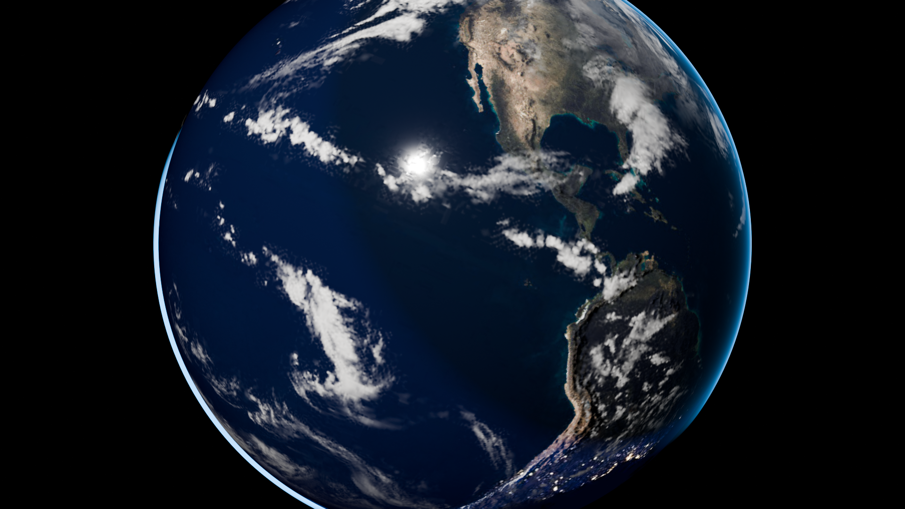

# Rotating Earth Viewed from Space 🌍

A gorgeous 5-second 1080p animation and 3D model of a rotating Earth viewed from space, created with Blender 5.2.



---

## 🛰️ Visual & Scientific Features

1. **Realistic Axial Tilt (地轴倾角 23.44°)**:
   - The Earth's rotation axis is tilted at $23.44^\circ$ ($0.409\text{ rad}$) relative to the orbital plane normal.
   - Rotates smoothly around its tilted axis for a 360° seamless cycle over 120 frames (5.0s @ 24fps).
2. **Dual Atmosphere & Cloud Circulation (独立云层与大气循环)**:
   - Multi-layered geometry: a separate outer sphere for the cloud layer ($R = 1.008$) casting subtle shadows onto the surface below.
   - Atmospheric differential rotation: clouds rotate slightly faster ($390^\circ$) than the solid surface ($360^\circ$), simulating atmospheric jet streams and trade wind patterns.
3. **Rayleigh Scattering Atmosphere Halo (瑞利散射大气边缘蓝晕)**:
   - An outer atmospheric shell ($R = 1.025$) featuring an inverted Fresnel falloff and additive blue scattering shader.
   - Accurately captures the thin blue glow seen by astronauts at the limb of the planet.
4. **Day/Night Terminator & City Lights (晨昏线与万家灯火)**:
   - Dynamic blend between high-resolution day land/ocean albedo textures and nocturnal city illumination textures.
   - City lights appear smoothly on the shadowed night side along the day/night terminator.
5. **Ocean Specular Glint & Topography (海面镜面高光与法线凹凸)**:
   - Specular map isolating continents from oceans to produce sharp solar glints on open water.
   - Normal map enhancing continental topography, mountain ranges, and continental shelves.
6. **Procedural Deep Space Starfield (深空星野)**:
   - Multi-octave Voronoi procedural starfield background providing realistic cosmic depth.

---

## 📁 Files

- `rotating_earth.mp4`: 5-second 1080p H.264 video animation (24fps, 120 frames).
- `earth.png`: 1080p high-resolution still render.
- `rotating_earth.blend`: Complete Blender scene file with materials, keyframe animations, camera, and lighting.
- `make_rotating_earth.py`: Python automation script to generate the entire scene, materials, animations, and render.
- `index.html`: Web-based interactive video player and educational guide.
- `textures/`: High-resolution NASA-derived Earth texture maps (day, night, normal, specular, clouds).

---

## 🚀 How to Run & View

### Open in Blender GUI
```bash
blender rotating_earth.blend
```
Press `Spacebar` to play the real-time rotation animation in the viewport.

### Web Viewer
Open `index.html` in any web browser to watch the looping 5-second video, toggle between video and 1080p still, and adjust playback speed.

### Re-render via Blender Headless
```bash
blender -b --factory-startup -P make_rotating_earth.py
```
